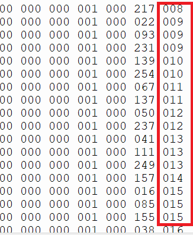

# touchpad-adventure

I've been obsessed with the [Framework Laptop](https://frame.work/) lately, especially after they announced the AMD model. However, I could not justify the purchase because I have a perfectly fine 2018 LG Gram. 
One day I was browing Framework's parts shop and saw this [touchpad module](https://frame.work/products/touchpad-kit?v=FRANFT0001). I am also obsessed with touchpads, and I really like Apple's Trackpads. However, buying a MacBook is even more unjustfiable (although M series chips are pretty intriguing...). Problem is, there is absolutely no market for decent stand alone touch pad input devices out there. So I thought, why not make one myself? 

I impulse bought the touchpad module without much thinking (this was much easier to justify. After all, it's not nearly $1000). After placing my order, I looked up the data sheets and learned that this particular touchpad module uses I2C. Good news is, I have a lot of Arduino and Arduino compatible microcontrollers lying around in my drawer from my custom keyboard phase (everyone goes through one, right?). Though I absoluetly had no I dea how I will connect the part and the microcontroller, but surely somebody out there would have done something neat with the touchpad module. 

Apparently touchpad is really niche! I found exactly "two" posts, [one from reddit](https://www.reddit.com/r/framework/comments/10yy99y/could_i_build_a_stand_alone_touchpad_using_the/) and [another from Framework forum](https://community.frame.work/t/framework-magic-trackpad/19453) about making a stand alone touchpad input device from Framework's touchpad kit. And none of them was step by step guide on how to make one yourself. I did find [a cool PCB made by Arya](https://www.tindie.com/products/crimier/framework-input-cover-controller/) that connects to the entire keyboard module (keyboard + touchpad + fingerprint sensor) using rpi2040 and turns it into a stand alone keyboard. While it was really cool, this was a keyboard and fingerprint sensor more than what I was trying to make.

So I started actually reading through the documentation to figure out what exactly did I sign myself up to. 

Framework's touchpad module has multiple female connectors that connect to Fingerprint sensor and keyboard. It then connects to the motherboard directly via a 51 pin ZIF female connector to 10156001-051100LF male connector. I think this means I can also order a fingerprint module, connect to the touchpad module, somehow figure out the wiring, ????, and profit, I have a touchpad & fingerprint reader. But I have a very sweaty palm and have a lot of trouble with finger print readers, so I'll reserve that for another time. 

For the I2C though, I need 4 connections: SCL (Clock), SDA (Data), Power Supply (5V), and GND (Ground). According to the [Framework official documentation](https://github.com/FrameworkComputer/Framework-Laptop-13/tree/main/Touchpad), each pin is connected to pins 34, 33, 32, and several (17, 21, 38, 15, 16, 25, 27). So the touchpad module requires 5V.

| Pin | Conn | Signal | Notes|
|-----|----- | ------ | ----- |
| 33 | 17 | GND |  |
| 34  | 34   | TP_SCL | Touchpad I2C SCL -- Clock Line|
| 35 | 18 | TP_INT | Touchpad interrupt GPIO | 
| 36 | 33 | TP_SDA | Touchpad I2C SDA -- Data Line | 
| 38 | 32 | 5VS | 5V, Connected to 5VS rail through a 0 ohm resistor |
| 39 | 20 | 5VALW | Fingerprint 5V | 
| 40 | 31 | USB_N | Fingerprint USB | 
| 41 | 21 | GND |  |
| 42 | 20 | USB_P | Fingerprint USB | 
| 37 | 19 | TP_BOARD_ID | |
| 26 | 38 | GND |  |
| 29 | 15 | GND |  |
| 31 | 16 | GND |  |
| 49 | 25 | GND |  | 
| 48 | 27 | FPR_LED_COM | 5V, Fingerprint LED |

Since Arya used rpi2040, I was hoping to finally find some use for my [Raspberry Pi Pico](https://www.raspberrypi.com/products/raspberry-pi-pico/) which I bought for no reason, but alas Raspberry Pi Pico only supports 3.3V. Fortunately though, I had a couple [Elite C](https://deskthority.net/wiki/Elite-C) microcontrollers that do have 5V and all the I2C pins. 

So now I have the touchpad module, I know which pins I need to connect to, and I know which pins on the microcontroller I need to connect my pins to. I have no cluew hat kind of code I would need to get the trackpad signal to cursor movement though. 
The touchpad module did come with a cable that connects to the motherboard. I thought about purchasing [a female breakout board](https://oshpark.com/shared_projects/MjMFKhqM), but the cable was a bit to bulky and would have restricted the final housing a lot. So I decided to ditch the cable it came with, and ordered a [51 pin ZIF breakout board from AliExpress](https://www.aliexpress.us/item/2251832656865723.html). Now it says it will take 2 weeks to arrive, but who knows when I would get it in mail. Once I get the part in mail (I'm thinking next year), I will need to solder the pins and cables. Yay... 

All I can do now is just waiting, and maybe doing some research on the software side of things. 


## 2023/12/18

Parts have arrived.


- 2 breakout boards for all 51 pins 
- 2 60mm ZIF cables (a little bent, but should be fine)


I connected the board and the breakout board together. I'm not really sure how I am supposed to cram all of these into a compact package. 
Once I have the Elite C code set up and confirm the assembly is working, maybe I could design a smaller PCB with just the few pins I need for the touchpad. In the mean time, breadboard would be good enough for testing purposes. 

Will come back after I solder some pins on both the board and Elite C. 

## 2023/12/20
Soldered the parts. Pardon the sloppy solder job!


On a hindsight, I should have soldered the pins on the opposite side for the ZIF breakout board. Good thing I have extra. 

While all four pins "should" be connected correctly, my computer was unable to recognize Elite C when I plugged it via USB cable. Nothing showed up under PORT for any of the IDEs I tried! I think I'm missing some driver because QMK Toolbox could recognize Elite C just fine.

Need to figure out a way to work with ATMega32U4 next. Also my head hurts from all the soldering fume I inhaled earlier. 

## 2023/12/22

Turns out Elite-C is not compatible with Arduino IDE out of the box. Makes sense because this board was made for drop-in replacement for Pro Micro for keyboard folks. 


# 2023/12/24 
After digging around, I learned that it is possible to convert an Arduino-compatible board (like my Elite-C) to be recognized by Arduino IDE by flashing Arduino compatible bootloader. This can be achieved using special boards called programmer, but I could also use another Arduino to flash another board. Arduino IDE has built in example called "Arduino as ISP" that allows one Arduino to serve as programmer for another board (Following this official guide: [Arduino as ISP and Arduino Bootloaders](https://support.arduino.cc/hc/en-us/articles/4408887452434-Flash-USB-to-serial-firmware-in-DFU-mode))

Luckily I had an Arduino Uno from college, so I uploaded Arduino as ISP sketch and wired up my Elite C. After what felt like an eternity, Arduino Uno reported it had finished its job. My Elite C should now be recognized as Arduino Leonardo. Indeed, when I plugged in Elite C, it was immediately available in Arduino IDE. Now I should be able to write Arduino code and upload to my Elite C. 

I did a quick test to see if things are actually working by uploading the classic "Blink" sketch. Upload was seemingly successful, but the blue LED on the board was not blinking. After some frantic research, I found out that Elite-C does not have any onboard LED other than the Power indicator LED. Instead I decided to wire potentiometer and print out the results to the serial port. Thankfully I saw text printed to the console changing values as I turned the dial. Things were looking good.  

While I could have found a way to write code in C and directly upload whatever was compiled to the Elite C, I figured it would be much easier to use Arduino as I have 0 experience with directly interfacing with a microcontroller. 

# 2023/12/30

It's been a rough week, since I wasn't able to get the I2C connection working with the Arduino for a week. I made many mistakes along the way, such as connecting the ZIF cable backwards (!) and adding unnecessary pull up resistors. Using the [I2C scanner sketch](https://playground.arduino.cc/Main/I2cScanner/), I finally figured out the pin connections and the device ID of the touchpad. 

| Pin | Elite C | Breakout board |
| --- | --- | --- |
| SDA | D2 | 36 |
| SCL | D3 | 34 | 
| GND | GND | 33 |
| 5V | VCC | 40 |

And no need for any additional resistors. 

Reported I2C address is: 

```
I2C device found at address 0x2C  ! (44)
I2C device found at address 0x33  ! (51)
done
```

Not sure why there are two addresses reported though. 

Also just in case, the device address on an actual framework laptop is `/devices/pci0000:00/0000:00:15.3/i2c_designware.2/i2c-2/i2c-PIXA3854:00/0018:093A:0274.0004/input/input9`

Got a reading from address 0x2C, getting "37" whenever I  do anything


# 1/5/2024 
New year, but not much progress. Cannot quite figure out how to get a meaningful reading out of the touchpad without official data sheet available from the manufacturer. I did reach out to PixArt through their support portal, but my request for data sheet was declined. They said they just provided the IC, and Framework took  care of everything else such as firmware and the part development. 

Anyways tried dumping some data out of the registers. 

```
passionfruit@raspberrypi:~ $ i2cdetect -y 1
     0  1  2  3  4  5  6  7  8  9  a  b  c  d  e  f
00:                         -- -- -- -- -- -- -- --
10: -- -- -- -- -- -- -- -- -- -- -- -- -- -- -- --
20: -- -- -- -- -- -- -- -- -- -- -- -- 2c -- -- --
30: -- -- -- 33 -- -- -- -- -- -- -- -- -- -- -- --
40: -- -- -- -- -- -- -- -- -- -- -- -- -- -- -- --
50: -- -- -- -- -- -- -- -- -- -- -- -- -- -- -- --
60: -- -- -- -- -- -- -- -- -- -- -- -- -- -- -- --
70: -- -- -- -- -- -- -- --
```

Outputs of i2cdump on each device:

```
passionfruit@raspberrypi:~ $ i2cdump -y 1 0x2c
No size specified (using byte-data access)
     0  1  2  3  4  5  6  7  8  9  a  b  c  d  e  f    0123456789abcdef
00: 00 00 00 00 00 00 00 00 00 00 00 00 00 00 00 00    ................
10: 00 00 00 00 00 00 00 00 00 00 00 00 00 00 00 00    ................
20: 1e 06 00 00 00 00 00 00 00 00 00 00 00 00 00 00    ??..............
30: 00 00 00 00 00 00 00 00 00 00 00 00 00 00 00 00    ................
40: 00 00 00 00 00 00 00 00 00 00 00 00 00 00 00 00    ................
50: 00 00 00 00 00 00 00 00 00 00 00 00 00 00 00 00    ................
60: 00 00 00 00 00 00 00 00 00 00 00 00 00 00 00 00    ................
70: 00 00 00 00 00 00 00 00 00 00 00 00 00 00 00 00    ................
80: 00 00 00 00 00 00 00 00 00 00 00 00 00 00 00 00    ................
90: 00 00 00 00 00 00 00 00 00 00 00 00 00 00 00 00    ................
a0: 00 00 00 00 00 00 00 00 00 00 00 00 00 00 00 00    ................
b0: 00 00 00 00 00 00 00 00 00 00 00 00 00 00 00 00    ................
c0: 00 00 00 00 00 00 00 00 00 00 00 00 00 00 00 00    ................
d0: 00 00 00 00 00 00 00 00 00 00 00 00 00 00 00 00    ................
e0: 00 00 00 00 00 00 00 00 00 00 00 00 00 00 00 00    ................
f0: 00 00 00 00 00 00 00 00 00 00 00 00 00 00 00 00    ................
```

```
passionfruit@raspberrypi:~ $ i2cdump -y 1 0x33
No size specified (using byte-data access)
     0  1  2  3  4  5  6  7  8  9  a  b  c  d  e  f    0123456789abcdef
00: 00 00 00 00 00 00 00 00 00 00 01 00 00 00 1c 18    ..........?...??
10: 00 00 00 00 00 00 00 00 00 00 00 00 00 00 00 00    ................
20: 00 00 00 00 00 00 00 00 00 00 00 00 00 00 00 00    ................
30: 00 00 00 00 00 00 00 00 00 00 00 00 00 00 00 00    ................
40: 00 00 00 00 00 00 00 00 00 00 00 00 00 00 00 00    ................
50: 00 00 00 00 00 00 00 00 00 00 00 00 00 00 00 00    ................
60: 00 00 00 00 00 00 00 00 00 00 00 00 00 00 00 00    ................
70: 09 00 00 00 00 00 00 00 00 00 00 00 00 01 00 06    ?............?.?
80: 00 00 00 00 00 00 00 00 00 00 01 00 00 00 1c 18    ..........?...??
90: 00 00 00 00 00 00 00 00 00 00 00 00 00 00 00 00    ................
a0: 00 00 00 00 00 00 00 00 00 00 00 00 00 00 00 00    ................
b0: 00 00 00 00 00 00 00 00 00 00 00 00 00 00 00 00    ................
c0: 00 00 00 00 00 00 00 00 00 00 00 00 00 00 00 00    ................
d0: 00 00 00 00 00 00 00 00 00 00 00 00 00 00 00 00    ................
e0: 00 00 00 00 00 00 00 00 00 00 00 00 00 00 00 00    ................
f0: 09 00 00 00 00 00 00 00 00 00 00 00 00 01 00 06    ?............?.?
```

Values all stayed the same whether a finger was touching the pad or not.

```
passionfruit@raspberrypi:/sys/bus/i2c/devices $ i2cdump -y 1 0x33
No size specified (using byte-data access)
     0  1  2  3  4  5  6  7  8  9  a  b  c  d  e  f    0123456789abcdef
00: 00 00 00 00 00 00 00 00 00 00 01 00 00 00 1c 18    ..........?...??
10: 74 16 00 00 00 00 00 00 00 00 00 00 00 00 00 00    t?..............
20: 00 00 00 00 00 00 00 00 00 00 00 00 00 00 00 00    ................
30: 00 00 00 00 00 00 00 00 00 00 00 00 00 00 00 00    ................
40: 00 00 00 00 00 00 00 00 00 00 00 00 00 00 00 00    ................
50: 00 00 00 00 00 00 00 00 00 00 00 00 00 00 00 00    ................
60: 00 00 00 00 00 00 00 00 00 00 00 00 00 00 00 00    ................
70: c1 02 00 00 00 00 4d 01 00 00 00 00 00 01 00 06    ??....M?.....?.?
80: 00 00 00 00 00 00 00 00 00 00 01 00 00 00 1c 18    ..........?...??
90: 74 16 00 00 00 00 00 00 00 00 00 00 00 00 00 00    t?..............
a0: 00 00 00 00 00 00 00 00 00 00 00 00 00 00 00 00    ................
b0: 00 00 00 00 00 00 00 00 00 00 00 00 00 00 00 00    ................
c0: 00 00 00 00 00 00 00 00 00 00 00 00 00 00 00 00    ................
d0: 00 00 00 00 00 00 00 00 00 00 00 00 00 00 00 00    ................
e0: 00 00 00 00 00 00 00 00 00 00 00 00 00 00 00 00    ................
f0: c1 02 00 00 00 00 4d 01 00 00 00 00 00 01 00 06    ??....M?.....?.?
```

I noticed some changes in the values within the dump, but honestly I'm not sure how to proceed further. I did order the framework input cover thing mentioned earlier, so I will try and see if that leads me anywhere. At this point my only option seems to be  reverse engineering the thing. 


# 3/1/2024
Brought the set up to 2600 meet up, and got some help on how to dump things out of the register and format so that it prints out pretty. But we couldn't quite figure out how to get actual data read out from either of the registers. 

Still stuck?  

# 4/20/2024
Was scrolling hackaday and found an article titled [Human-Interfacing devices: HID over I2C](https://hackaday.com/2024/04/17/human-interfacing-devices-hid-over-i2c/). From 3 days ago. Clicked on it, and it's written by no one other than Arya, and contained whole lot of information on how to work with HID over I2C device. It turns out, I got the device ID 0x2c correct. All I had to do was read blocks out of the register 0x20 on this device on 0x2c. This was not possible through Raspberry Pi 3 I was using, as block read is not supported.

```
$ i2cdetect -F 1
Functionalities implemented by /dev/i2c-1:
I2C                              yes
SMBus Quick Command              yes
SMBus Send Byte                  yes
SMBus Receive Byte               yes
SMBus Write Byte                 yes
SMBus Read Byte                  yes
SMBus Write Word                 yes
SMBus Read Word                  yes
SMBus Process Call               yes
SMBus Block Write                yes
SMBus Block Read                 no
SMBus Block Process Call         no
SMBus PEC                        yes
I2C Block Write                  yes
I2C Block Read                   yes
```

Arya was using Circuit Python in the article, so I brought out Raspberry Pi Pico and installed Circuit Python. Only catch was that Pi Pico is 3.3V only, so I figured I could power the touchpad using the 5V pins from Raspberry Pi 3. 

However, when I loaded i2c, Circuit Python complained about missing pull up resistors.

```
import block
i2c = block.I2C() # This has to be something else, but forgot to write it down. 
```

That meant I had to use the power from the Raspberry Pi Pico, and then connect SDA/SCL with the power using resistors. Would touchpad work with 3.3V though? 

So I just pulled out the Elite C and wired out the breakout board, and ran the old script I had, which read a byte from 0x20 on I2c device 0x2c which always returns 37. 

Then it occurred to me, what if I read the entire block from 0x20 like Arya was doing? So I modified the script a little, and I actually was able to read meaningful data out of the touchpad.  

```
#include <Wire.h>  

#define ADDR 0x2C

void setup() {
  Wire.begin();  
  Serial.begin(115200);
  Serial.print("init");
}


void loop() {

  Wire.requestFrom(ADDR, 16);
  while(Wire.available()){
    char strBuf[4];
    byte c = Wire.read();
    sprintf(strBuf, "%02x", c);
    Serial.print(strBuf);
    Serial.print(" ");
  }

  Serial.print("\n");
  
  delay(1000); 
}
```

Some sample output
```
25 00 01 03 00 23 02 b4 01 00 00 00 00 00 00 00 
25 00 01 03 00 24 02 b4 01 00 00 00 00 00 00 00 
25 00 01 03 00 28 02 b4 01 03 01 48 03 dd 01 00 
25 00 01 03 00 2e 02 b4 01 03 01 49 03 dc 01 00 
25 00 01 03 00 35 02 b5 01 03 01 4c 03 dc 01 00 
25 00 01 03 00 fd 01 a7 01 03 01 07 03 dd 01 00 
25 00 01 03 00 47 02 8a 01 03 01 42 03 ec 01 00 
25 00 01 03 00 63 02 99 01 03 01 51 03 09 02 00 
25 00 01 03 00 1c 02 a8 01 03 01 0a 03 12 02 00 
25 00 01 03 00 e4 01 e7 01 03 01 0e 03 4d 02 00 
25 00 01 03 00 b4 01 0c 02 03 01 2b 03 5b 02 03 
00 00 01 01 00 f3 02 27 01 00 00 00 00 00 00 00 
00 00 01 01 00 f3 02 27 01 00 00 00 00 00 00 00 
00 00 01 01 00 f3 02 27 01 00 00 00 00 00 00 00 
00 00 01 01 00 f3 02 27 01 00 00 00 00 00 00 00 
00 00 01 01 00 f3 02 27 01 00 00 00 00 00 00 00 
00 00 01 01 00 f3 02 27 01 00 00 00 00 00 00 00 
```

Obviously, `00 00 01 01 00 f3 02 27 01 00 00 00 00 00 00 00` is the "idle" state.

I would need to read more on the spec, but it looks like these values are the HID descriptor, so I should be able to further decode what this byte soup means. Regardless, a huge progress. 


## Single finger
```
25 00 01 03 00 a1 01 95 01 03 01 bb 02 e5 01 03 
25 00 01 03 00 a5 01 8d 01 03 01 f1 02 ba 01 03 
25 00 01 03 00 de 01 63 01 03 01 31 03 93 01 03 
25 00 01 01 00 de 01 63 01 01 01 31 03 93 01 01 
00 00 01 01 00 de 01 63 01 01 01 31 03 93 01 01 
00 00 01 01 00 de 01 63 01 01 01 31 03 93 01 01 
25 00 01 03 00 a3 02 92 00 00 00 00 00 00 00 00 
25 00 01 03 00 a3 02 92 00 00 00 00 00 00 00 00 
25 00 01 03 00 a3 02 92 00 00 00 00 00 00 00 00 
25 00 01 03 00 a3 02 92 00 00 00 00 00 00 00 00 
25 00 01 03 00 a3 02 a4 00 00 00 00 00 00 00 00 
25 00 01 03 00 a9 02 3f 01 00 00 00 00 00 00 00 
25 00 01 03 00 b5 02 f8 01 00 00 00 00 00 00 00 
25 00 01 01 00 b5 02 f8 01 00 00 00 00 00 00 00 
25 00 01 03 01 ea 02 0d 00 00 00 00 00 00 00 00 
25 00 01 03 01 0e 03 12 01 00 00 00 00 00 00 00 
25 00 01 01 01 0e 03 12 01 00 00 00 00 00 00 00 
25 00 01 03 00 43 03 e6 00 00 00 00 00 00 00 00 
25 00 01 01 00 43 03 e6 00 00 00 00 00 00 00 00 
25 00 01 03 01 e2 03 01 00 00 00 00 00 00 00 00 
25 00 01 03 01 e1 03 f0 00 00 00 00 00 00 00 00 
25 00 01 01 01 e1 03 f0 00 00 00 00 00 00 00 00 
25 00 01 03 00 84 03 2c 00 00 00 00 00 00 00 00
```

## Two fingers
```
00 00 01 01 00 7f 03 9c 01 00 00 00 00 00 00 00 
00 00 01 01 00 7f 03 9c 01 00 00 00 00 00 00 00 
25 00 01 03 00 51 02 4d 00 00 00 00 00 00 00 00 
25 00 01 03 00 51 02 4d 00 00 00 00 00 00 00 00 
25 00 01 03 00 51 02 4d 00 00 00 00 00 00 00 00 
25 00 01 03 00 51 02 4d 00 03 01 71 03 94 00 00 
25 00 01 03 00 67 02 a0 00 03 01 87 03 e9 00 00 
25 00 01 01 00 67 02 a0 00 01 01 87 03 e9 00 00 
25 00 01 03 02 3b 02 10 00 03 03 c1 03 39 00 00 
25 00 01 03 02 69 02 fd 00 03 03 d1 03 3b 01 00 
25 00 01 01 02 69 02 fd 00 01 03 d1 03 3b 01 00 
25 00 01 03 00 1d 02 6f 02 03 01 46 03 cd 02 00 
25 00 01 03 00 35 02 e9 01 03 01 70 03 3a 02 00 
25 00 01 03 00 22 02 42 01 01 01 70 03 3a 02 00 
25 00 01 01 00 22 02 42 01 00 00 00 00 00 00 00 
25 00 01 03 00 00 02 ae 00 03 01 70 03 dd 00 00 
25 00 01 03 00 00 02 af 00 03 01 70 03 de 00 00 
```

## Three fingers 
```
00 00 01 01 00 03 02 b7 00 01 01 71 03 e5 00 00 
00 00 01 01 00 03 02 b7 00 01 01 71 03 e5 00 00 
25 00 01 03 00 c0 02 0a 00 03 01 9a 01 76 00 00 
25 00 01 03 00 c0 02 0a 00 03 01 9a 01 76 00 03 
25 00 01 03 00 c0 02 0a 00 03 01 9a 01 76 00 03 
25 00 01 03 00 c0 02 0a 00 03 01 9a 01 76 00 03 
25 00 01 01 00 c0 02 0a 00 01 01 9a 01 76 00 01 
25 00 01 03 00 cf 00 99 00 00 00 00 00 00 00 00 
25 00 01 03 00 cf 00 99 00 00 00 00 00 00 00 00 
25 00 01 03 00 cf 00 99 00 03 01 e8 01 0a 00 00 
25 00 01 03 00 cf 00 99 00 03 01 e8 01 0a 00 00 
25 00 01 01 00 cf 00 99 00 01 01 e8 01 0a 00 00 
25 00 01 03 00 d4 01 d9 00 00 00 00 00 00 00 00 
25 00 01 03 00 d4 01 d9 00 03 01 54 03 30 01 03 
25 00 01 03 00 d4 01 d9 00 03 01 54 03 30 01 03 
25 00 01 03 00 d4 01 d9 00 03 01 54 03 30 01 03 
25 00 01 01 00 d4 01 d9 00 01 01 54 03 30 01 01 
00 00 01 01 00 d4 01 d9 00 01 01 54 03 30 01 01 
00 00 01 01 00 d4 01 d9 00 01 01 54 03 30 01 01 
00 00 01 01 00 d4 01 d9 00 01 01 54 03 30 01 01
```

Apparently something is not right with how I'm printing the bytes. Should tweak the code until I get the right HID descriptor out.

# Sometime in September
Learned about something called FT260 mentioned in [Framework Forum](https://community.frame.work/t/touchpad-with-2-buttons-instead-of-clickpad/36343/18), and ordered [UMFT260EV1A](https://ftdichip.com/products/umft260ev1a/)
Connected it up but wasn't able to do much with it. Honestly not sure how this comes into the picture. Would need more research 

| Name | FT 260 | Dev board | Touchpad | 
|---|---|---|---|
| SCL | DIO5 | IO0 | 34 | 
| SDA | DIO6 | IO1 | 36 |
| INT | DIO8 | IO3 | 35 |
| 5V | - | - | 40 | 
| GND | - | - | 33 |

# 10/3/2024 

Been using Micropython on the Raspberry Pi Pico to do the I2C over HID circus. 

Few things I learned in the past few days:
* Touchpad alone can run on 3v3.
* Micropython 1.23 now has USB device support which could be used for this (as was mentioned in Arya's article)
* I have been able to read "something" out of the touchpad before. I'm still getting the same data, but I was not reading the full data.
  * 25 in the beginning meant 0x25 = 37, so I should have been reading 37 bytes.
* The data extracted from I2C has some kind of pattern. Not sure what the details are, need more probing
* data from I2C is probably not the HID Descriptor that could be readily used; this data has to be translated into Mouse HID Descriptor again and then sent to the host


# 10/4/2024 

Some more observations. Each output from I2C is something like this: 

```
03 00 3b 00 15 00 03 01 f3 04 37 00 03 02 5d 00 30 03 03 03 de 04 1b 03 00 00 00 00 00 00 04 00 21 27
```

First Finger reported `3b 00 15 00`. In these 4 bytes, first two correspond to the X coordinate and the latter two correspond to the Y coordinate. 
That explains why each fingers have 2+4 bytes repeated.

So I think these 2+4 bytes mean something like this: 

| ??? | finger index (0 based)| X First Byte | X Second Byte | Y First Byte | Y Second Byte| 
|---|---|---|---|---|---|
|03 | 01 | f3 | 04 | 37 | 00 |

These kind of align with what is said in PCT1336QN's manual, though that one has way too many more registors than what I'm currently reading out of PCT3854QR. 

```python
# Scan for connected I2C devices  
import machine


SDA_PIN = machine.Pin(4)
SCL_PIN = machine.Pin(5)
i2c = machine.I2C(0, sda=SDA_PIN, scl=SCL_PIN, freq=500000)


TOUCHPAD_ADDR = 0x2c
REPORT_ID = 0x01 

def helper_function(abc):
    return ([abc[i:i+2] for i in range(0, len(abc), 2)])

def helper_function_to_int(myList):
    k = [int(x, 16) for x in myList]
    v = ["{:03d}".format(x) for x in k]
    return  [str(x) for x in v]

def runner():
    while True:
        try:
            l = i2c.readfrom(TOUCHPAD_ADDR, 1)[0]
            if l:
                d = i2c.readfrom(TOUCHPAD_ADDR, l)
                if d[2] != REPORT_ID:
                    print("WARNING")
                    print(l, d)
                else:
                    d = d[3:]
                    formatted = helper_function(d.hex())
                    output = helper_function_to_int(formatted)
                    print(" ".join(output))
                    
        except OSError:
            print("Nothing burger")
            
        


runner()
```

I'm using above code to print out the data to the console. In hopes of plotting out the data, I'm formatting the byte data to 3 digit int. 
I attempted plotting the X Y coordinates (using the formula `=A + 255*B`) and got a nice line out of it.

This still feels like raw data though. This chip is supposed to give HID over I2C, so I don't think I should be getting the raw finger coordinate data. Shouldn't this chip interpret all these finger movements and return some HID descriptor instead? 


# 10/8/2024

While I have some mystery values in each row, I at least have the coordinates for the 5 fingers. Still cannot quite figure out why I'm not reading the HID descriptor directly from the HID, but I'm going to try using this raw data to move mouse cursor around. 

From rough calculations, the X dimension ranges from `0 to 0x0539 = 256*5+57 = 1337` and Y dimension ranges from 0 to `0x36C = 256*3 + 108 = 876`

```
001 000 **057 005** 046 003
003 000 231 004 **108 003**
```

These values actually match the values in Arya's descriptor ([HID_USAGE_DESKTOP_X LOGICAL MAX = 1337](https://github.com/0xAryaCAFE/spicy-micropython/blob/3810a95b423668ce8a7be2f6eb615eec5d33fedd/ports/rp2/tusb_port.c#L142) and [HID_USAGE_DESKTOP_Y LOGICAL MAX = 876](https://github.com/0xAryaCAFE/spicy-micropython/blob/3810a95b423668ce8a7be2f6eb615eec5d33fedd/ports/rp2/tusb_port.c#L146))

I can also dump the descriptor from my framework laptop and compare it with the data I am reading from I2C as well. 

As of now, the first byte which has values 0x00 to 0x03 seem to be related to palm rejection or some sort of indication whether this is a legitimate touch or accidental. 

When I have one point contact, I see the byte has value 0x03. When I smear my fingers around, I can see the value fluctuating. 

| palm rejection (??) | finger index (0 based)| X First Byte | X Second Byte | Y First Byte | Y Second Byte| 
|---|---|---|---|---|---|
|03 | 01 | f3 | 04 | 37 | 00 |

As for the last 4 bytes, I realized the last byte is some kind of ID that increments by 1 every time I read a row. It loops from 0x00 to 0xff, and when the device starts, it initiates from 0. 



| number of fingers | ??? but always 0x00 | ??? | ID % 255 |
| --- | --- | --- | --- |
|05 | 00 | e2 | d5 |


# 10/11/2024

How would interrupt work for this device? Does it mean there is a signal coming out of it when interrupt is sent? 
So can I just hook it up to a GPIO and listen to it?

Some things to consider... but can definitely wait after translating finger signal to descriptor is done 


mystery penultimate byte also ranges from 0 to 255, so it does use all the values. 


Some kind of bit operation to quickly process touch registers & extract coordinates? 

C or python?


Resources: 
- [framework embedded controller i2c_hid.h (from chromebook)](https://github.com/FrameworkComputer/EmbeddedController/blob/hx20-hx30/include/i2c_hid.h)
- [framework embedded controller i2c_hid_touchpad.h (from  chromebook)](https://github.com/FrameworkComputer/EmbeddedController/blob/hx20-hx30/include/i2c_hid_touchpad.h)
- [framework embedded controller i2c_hid_touchpad.c (from  chromebook)](https://github.com/FrameworkComputer/EmbeddedController/blob/hx20-hx30/common/i2c_hid_touchpad.c)
- [synaptics touchpad driver - SPI to HID](https://github.com/delingren/synaptics_touchpad/blob/main/touchpad.ino#L368)
- [nrf52-i2c-hid demo (Adafruit feather)](https://github.com/NordicPlayground/nrf52-i2c-hid-demo/blob/master/nrf52-i2c-hid-demo/main.c)
- [micropython USB hid-device-mouse example](https://github.com/micropython/micropython-lib/blob/master/micropython/usb/usb-device-mouse/usb/device/mouse.py)


# 10/16/2024

I was rereading everything and I realized I was not reading from a specific register. 
From what I could gather, HID over I2C is supposed to return HID descriptor directly over I2C interface. So whatever I was reading was cool in a sense that it gives me x/y coordinates, that was incorrect.

With the lack of documentation, I figured I could just scan the I2C device over some range and see if I could get something out. 

I wrote a little code to dump 64 bytes from each register on 0x2C starting from 0 to 255

```
def helper_function_to_int(myList):
    k = [int(x, 16) for x in myList]
    v = ["{:03d}".format(x) for x in k]
    return  [str(x) for x in v]

def brute_force():
    for i in range(0, 256):
        l = i2c.readfrom_mem(TOUCHPAD_ADDR, i, 64)
        print(i, " ".join(helper_function(l.hex())))

```

and just scrolled through each nonsense lines, and then something caught my eyes. 

```
24 00 00 00 01 af 02 21 00 24 00 25 00 25 00 00 00 22 00 23 00 3a 09 74 02 04 07 00 00 00 00 00 00 00 03 00 91 f5 00 00 00 00 00 00 00 00 00 00 00 00 00 00 00 00 00 00 00 00 00 00 00 00 00 00 00
25 00 00 00 01 af 02 21 00 24 00 25 00 25 00 00 00 22 00 23 00 3a 09 74 02 04 07 00 00 00 00 00 00 00 03 00 91 f5 00 00 00 00 00 00 00 00 00 00 00 00 00 00 00 00 00 00 00 00 00 00 00 00 00 00 00
26 00 00 00 01 af 02 21 00 24 00 25 00 25 00 00 00 22 00 23 00 3a 09 74 02 04 07 00 00 00 00 00 00 00 03 00 91 f5 00 00 00 00 00 00 00 00 00 00 00 00 00 00 00 00 00 00 00 00 00 00 00 00 00 00 00
27 00 00 00 01 af 02 21 00 24 00 25 00 25 00 00 00 22 00 23 00 3a 09 74 02 04 07 00 00 00 00 00 00 00 03 00 91 f5 00 00 00 00 00 00 00 00 00 00 00 00 00 00 00 00 00 00 00 00 00 00 00 00 00 00 00
28 00 00 00 01 af 02 21 00 24 00 25 00 25 00 00 00 22 00 23 00 3a 09 74 02 04 07 00 00 00 00 00 00 00 03 00 91 f5 00 00 00 00 00 00 00 00 00 00 00 00 00 00 00 00 00 00 00 00 00 00 00 00 00 00 00
29 00 00 00 01 af 02 21 00 24 00 25 00 25 00 00 00 22 00 23 00 3a 09 74 02 04 07 00 00 00 00 00 00 00 03 00 91 f5 00 00 00 00 00 00 00 00 00 00 00 00 00 00 00 00 00 00 00 00 00 00 00 00 00 00 00
30 00 00 00 01 af 02 21 00 24 00 25 00 25 00 00 00 22 00 23 00 3a 09 74 02 04 07 00 00 00 00 00 00 00 03 00 91 f5 00 00 00 00 00 00 00 00 00 00 00 00 00 00 00 00 00 00 00 00 00 00 00 00 00 00 00
31 00 00 00 01 af 02 21 00 24 00 25 00 25 00 00 00 22 00 23 00 3a 09 74 02 04 07 00 00 00 00 00 00 00 03 00 91 f5 00 00 00 00 00 00 00 00 00 00 00 00 00 00 00 00 00 00 00 00 00 00 00 00 00 00 00
32 1e 00 00 01 af 02 21 00 24 00 25 00 25 00 00 00 22 00 23 00 3a 09 74 02 04 07 00 00 00 00 00 00 00 00 00 00 00 00 00 00 00 00 00 00 00 00 00 00 00 00 00 00 00 00 00 00 00 00 00 00 00 00 00 00
33 05 01 09 02 a1 01 85 02 05 01 09 01 a1 00 05 09 19 01 29 02 15 00 25 01 75 01 95 02 81 02 05 0d 09 32 75 01 95 01 81 02 75 05 95 01 81 03 05 01 75 10 95 01 35 00 45 00 16 00 80 26 ff 7f 09 30
34 00 00 00 01 af 02 21 00 24 00 25 00 25 00 00 00 22 00 23 00 3a 09 74 02 04 07 00 00 00 00 00 00 00 03 00 91 f5 00 00 00 00 00 00 00 00 00 00 00 00 00 00 00 00 00 00 00 00 00 00 00 00 00 00 00
35 00 00 00 01 af 02 21 00 24 00 25 00 25 00 00 00 22 00 23 00 3a 09 74 02 04 07 00 00 00 00 00 00 00 03 00 91 f5 00 00 00 00 00 00 00 00 00 00 00 00 00 00 00 00 00 00 00 00 00 00 00 00 00 00 00
36 00 00 00 01 af 02 21 00 24 00 25 00 25 00 00 00 22 00 23 00 3a 09 74 02 04 07 00 00 00 00 00 00 00 03 00 91 f5 00 00 00 00 00 00 00 00 00 00 00 00 00 00 00 00 00 00 00 00 00 00 00 00 00 00 00
37 00 00 00 01 af 02 21 00 24 00 25 00 25 00 00 00 22 00 23 00 3a 09 74 02 04 07 00 00 00 00 00 00 00 03 00 91 f5 00 00 00 00 00 00 00 00 00 00 00 00 00 00 00 00 00 00 00 00 00 00 00 00 00 00 00
38 00 00 00 01 af 02 21 00 24 00 25 00 25 00 00 00 22 00 23 00 3a 09 74 02 04 07 00 00 00 00 00 00 00 03 00 91 f5 00 00 00 00 00 00 00 00 00 00 00 00 00 00 00 00 00 00 00 00 00 00 00 00 00 00 00
```

line 33 (0x21) had something that awfully resembles HID Descriptor. And indeed, it was correct:

```
0x05, 0x01,        // Usage Page (Generic Desktop Ctrls)
0x09, 0x02,        // Usage (Mouse)
0xA1, 0x01,        // Collection (Application)
0x85, 0x02,        //   Report ID (2)
0x05, 0x01,        //   Usage Page (Generic Desktop Ctrls)
0x09, 0x01,        //   Usage (Pointer)
0xA1, 0x00,        //   Collection (Physical)
0x05, 0x09,        //     Usage Page (Button)
0x19, 0x01,        //     Usage Minimum (0x01)
0x29, 0x02,        //     Usage Maximum (0x02)
0x15, 0x00,        //     Logical Minimum (0)
0x25, 0x01,        //     Logical Maximum (1)
0x75, 0x01,        //     Report Size (1)
0x95, 0x02,        //     Report Count (2)
0x81, 0x02,        //     Input (Data,Var,Abs,No Wrap,Linear,Preferred State,No Null Position)
0x05, 0x0D,        //     Usage Page (Digitizer)
0x09, 0x32,        //     Usage (In Range)
0x75, 0x01,        //     Report Size (1)
0x95, 0x01,        //     Report Count (1)
0x81, 0x02,        //     Input (Data,Var,Abs,No Wrap,Linear,Preferred State,No Null Position)
0x75, 0x05,        //     Report Size (5)
0x95, 0x01,        //     Report Count (1)
0x81, 0x03,        //     Input (Const,Var,Abs,No Wrap,Linear,Preferred State,No Null Position)
0x05, 0x01,        //     Usage Page (Generic Desktop Ctrls)
0x75, 0x10,        //     Report Size (16)
0x95, 0x01,        //     Report Count (1)
0x35, 0x00,        //     Physical Minimum (0)
0x45, 0x00,        //     Physical Maximum (0)
0x16, 0x00, 0x80,  //     Logical Minimum (-32768)
0x26, 0xFF, 0x7F,  //     Logical Maximum (32767)
0x09, 0x30,        //     Usage (X)

// 64 bytes

```

😊

0x21 on 0x2C to retrieve the descriptor. 

Full descriptor below: 

```
0x05, 0x01,        // Usage Page (Generic Desktop Ctrls)
0x09, 0x02,        // Usage (Mouse)
0xA1, 0x01,        // Collection (Application)
0x85, 0x02,        //   Report ID (2)
0x05, 0x01,        //   Usage Page (Generic Desktop Ctrls)
0x09, 0x01,        //   Usage (Pointer)
0xA1, 0x00,        //   Collection (Physical)
0x05, 0x09,        //     Usage Page (Button)
0x19, 0x01,        //     Usage Minimum (0x01)
0x29, 0x02,        //     Usage Maximum (0x02)
0x15, 0x00,        //     Logical Minimum (0)
0x25, 0x01,        //     Logical Maximum (1)
0x75, 0x01,        //     Report Size (1)
0x95, 0x02,        //     Report Count (2)
0x81, 0x02,        //     Input (Data,Var,Abs,No Wrap,Linear,Preferred State,No Null Position)
0x05, 0x0D,        //     Usage Page (Digitizer)
0x09, 0x32,        //     Usage (In Range)
0x75, 0x01,        //     Report Size (1)
0x95, 0x01,        //     Report Count (1)
0x81, 0x02,        //     Input (Data,Var,Abs,No Wrap,Linear,Preferred State,No Null Position)
0x75, 0x05,        //     Report Size (5)
0x95, 0x01,        //     Report Count (1)
0x81, 0x03,        //     Input (Const,Var,Abs,No Wrap,Linear,Preferred State,No Null Position)
0x05, 0x01,        //     Usage Page (Generic Desktop Ctrls)
0x75, 0x10,        //     Report Size (16)
0x95, 0x01,        //     Report Count (1)
0x35, 0x00,        //     Physical Minimum (0)
0x45, 0x00,        //     Physical Maximum (0)
0x16, 0x00, 0x80,  //     Logical Minimum (-32768)
0x26, 0xFF, 0x7F,  //     Logical Maximum (32767)
0x09, 0x30,        //     Usage (X)
0x81, 0x26,        //     Input (Data,Var,Rel,No Wrap,Linear,No Preferred State,No Null Position)
0x16, 0x00, 0x80,  //     Logical Minimum (-32768)
0x26, 0xFF, 0x7F,  //     Logical Maximum (32767)
0x09, 0x31,        //     Usage (Y)
0x81, 0x26,        //     Input (Data,Var,Rel,No Wrap,Linear,No Preferred State,No Null Position)
0xC0,              //   End Collection
0xC0,              // End Collection
0x05, 0x0D,        // Usage Page (Digitizer)
0x09, 0x05,        // Usage (Touch Pad)
0xA1, 0x01,        // Collection (Application)
0x85, 0x01,        //   Report ID (1)
0x05, 0x0D,        //   Usage Page (Digitizer)
0x09, 0x22,        //   Usage (Finger)
0xA1, 0x02,        //   Collection (Logical)
0x09, 0x47,        //     Usage (0x47)
0x09, 0x42,        //     Usage (Tip Switch)
0x15, 0x00,        //     Logical Minimum (0)
0x25, 0x01,        //     Logical Maximum (1)
0x75, 0x01,        //     Report Size (1)
0x95, 0x02,        //     Report Count (2)
0x81, 0x02,        //     Input (Data,Var,Abs,No Wrap,Linear,Preferred State,No Null Position)
0x95, 0x06,        //     Report Count (6)
0x81, 0x03,        //     Input (Const,Var,Abs,No Wrap,Linear,Preferred State,No Null Position)
0x09, 0x51,        //     Usage (0x51)
0x25, 0x0F,        //     Logical Maximum (15)
0x75, 0x08,        //     Report Size (8)
0x95, 0x01,        //     Report Count (1)
0x81, 0x02,        //     Input (Data,Var,Abs,No Wrap,Linear,Preferred State,No Null Position)
0x05, 0x01,        //     Usage Page (Generic Desktop Ctrls)
0x09, 0x30,        //     Usage (X)
0x75, 0x10,        //     Report Size (16)
0x55, 0x0E,        //     Unit Exponent (-2)
0x65, 0x11,        //     Unit (System: SI Linear, Length: Centimeter)
0x35, 0x00,        //     Physical Minimum (0)
0x46, 0x5A, 0x04,  //     Physical Maximum (1114)
0x27, 0x39, 0x05, 0x00, 0x00,  //     Logical Maximum (1336)
0x81, 0x02,        //     Input (Data,Var,Abs,No Wrap,Linear,Preferred State,No Null Position)
0x09, 0x31,        //     Usage (Y)
0x46, 0xDA, 0x02,  //     Physical Maximum (730)
0x27, 0x6C, 0x03, 0x00, 0x00,  //     Logical Maximum (875)
0x81, 0x02,        //     Input (Data,Var,Abs,No Wrap,Linear,Preferred State,No Null Position)
0xC0,              //   End Collection
0x05, 0x0D,        //   Usage Page (Digitizer)
0x09, 0x22,        //   Usage (Finger)
0xA1, 0x02,        //   Collection (Logical)
0x09, 0x47,        //     Usage (0x47)
0x09, 0x42,        //     Usage (Tip Switch)
0x15, 0x00,        //     Logical Minimum (0)
0x25, 0x01,        //     Logical Maximum (1)
0x75, 0x01,        //     Report Size (1)
0x95, 0x02,        //     Report Count (2)
0x81, 0x02,        //     Input (Data,Var,Abs,No Wrap,Linear,Preferred State,No Null Position)
0x95, 0x06,        //     Report Count (6)
0x81, 0x03,        //     Input (Const,Var,Abs,No Wrap,Linear,Preferred State,No Null Position)
0x09, 0x51,        //     Usage (0x51)
0x25, 0x0F,        //     Logical Maximum (15)
0x75, 0x08,        //     Report Size (8)
0x95, 0x01,        //     Report Count (1)
0x81, 0x02,        //     Input (Data,Var,Abs,No Wrap,Linear,Preferred State,No Null Position)
0x05, 0x01,        //     Usage Page (Generic Desktop Ctrls)
0x09, 0x30,        //     Usage (X)
0x75, 0x10,        //     Report Size (16)
0x55, 0x0E,        //     Unit Exponent (-2)
0x65, 0x11,        //     Unit (System: SI Linear, Length: Centimeter)
0x35, 0x00,        //     Physical Minimum (0)
0x46, 0x5A, 0x04,  //     Physical Maximum (1114)
0x27, 0x39, 0x05, 0x00, 0x00,  //     Logical Maximum (1336)
0x81, 0x02,        //     Input (Data,Var,Abs,No Wrap,Linear,Preferred State,No Null Position)
0x09, 0x31,        //     Usage (Y)
0x46, 0xDA, 0x02,  //     Physical Maximum (730)
0x27, 0x6C, 0x03, 0x00, 0x00,  //     Logical Maximum (875)
0x81, 0x02,        //     Input (Data,Var,Abs,No Wrap,Linear,Preferred State,No Null Position)
0xC0,              //   End Collection
0x05, 0x0D,        //   Usage Page (Digitizer)
0x09, 0x22,        //   Usage (Finger)
0xA1, 0x02,        //   Collection (Logical)
0x09, 0x47,        //     Usage (0x47)
0x09, 0x42,        //     Usage (Tip Switch)
0x15, 0x00,        //     Logical Minimum (0)
0x25, 0x01,        //     Logical Maximum (1)
0x75, 0x01,        //     Report Size (1)
0x95, 0x02,        //     Report Count (2)
0x81, 0x02,        //     Input (Data,Var,Abs,No Wrap,Linear,Preferred State,No Null Position)
0x95, 0x06,        //     Report Count (6)
0x81, 0x03,        //     Input (Const,Var,Abs,No Wrap,Linear,Preferred State,No Null Position)
0x09, 0x51,        //     Usage (0x51)
0x25, 0x0F,        //     Logical Maximum (15)
0x75, 0x08,        //     Report Size (8)
0x95, 0x01,        //     Report Count (1)
0x81, 0x02,        //     Input (Data,Var,Abs,No Wrap,Linear,Preferred State,No Null Position)
0x05, 0x01,        //     Usage Page (Generic Desktop Ctrls)
0x09, 0x30,        //     Usage (X)
0x75, 0x10,        //     Report Size (16)
0x55, 0x0E,        //     Unit Exponent (-2)
0x65, 0x11,        //     Unit (System: SI Linear, Length: Centimeter)
0x35, 0x00,        //     Physical Minimum (0)
0x46, 0x5A, 0x04,  //     Physical Maximum (1114)
0x27, 0x39, 0x05, 0x00, 0x00,  //     Logical Maximum (1336)
0x81, 0x02,        //     Input (Data,Var,Abs,No Wrap,Linear,Preferred State,No Null Position)
0x09, 0x31,        //     Usage (Y)
0x46, 0xDA, 0x02,  //     Physical Maximum (730)
0x27, 0x6C, 0x03, 0x00, 0x00,  //     Logical Maximum (875)
0x81, 0x02,        //     Input (Data,Var,Abs,No Wrap,Linear,Preferred State,No Null Position)
0xC0,              //   End Collection
0x05, 0x0D,        //   Usage Page (Digitizer)
0x09, 0x22,        //   Usage (Finger)
0xA1, 0x02,        //   Collection (Logical)
0x09, 0x47,        //     Usage (0x47)
0x09, 0x42,        //     Usage (Tip Switch)
0x15, 0x00,        //     Logical Minimum (0)
0x25, 0x01,        //     Logical Maximum (1)
0x75, 0x01,        //     Report Size (1)
0x95, 0x02,        //     Report Count (2)
0x81, 0x02,        //     Input (Data,Var,Abs,No Wrap,Linear,Preferred State,No Null Position)
0x95, 0x06,        //     Report Count (6)
0x81, 0x03,        //     Input (Const,Var,Abs,No Wrap,Linear,Preferred State,No Null Position)
0x09, 0x51,        //     Usage (0x51)
0x25, 0x0F,        //     Logical Maximum (15)
0x75, 0x08,        //     Report Size (8)
0x95, 0x01,        //     Report Count (1)
0x81, 0x02,        //     Input (Data,Var,Abs,No Wrap,Linear,Preferred State,No Null Position)
0x05, 0x01,        //     Usage Page (Generic Desktop Ctrls)
0x09, 0x30,        //     Usage (X)
0x75, 0x10,        //     Report Size (16)
0x55, 0x0E,        //     Unit Exponent (-2)
0x65, 0x11,        //     Unit (System: SI Linear, Length: Centimeter)
0x35, 0x00,        //     Physical Minimum (0)
0x46, 0x5A, 0x04,  //     Physical Maximum (1114)
0x27, 0x39, 0x05, 0x00, 0x00,  //     Logical Maximum (1336)
0x81, 0x02,        //     Input (Data,Var,Abs,No Wrap,Linear,Preferred State,No Null Position)
0x09, 0x31,        //     Usage (Y)
0x46, 0xDA, 0x02,  //     Physical Maximum (730)
0x27, 0x6C, 0x03, 0x00, 0x00,  //     Logical Maximum (875)
0x81, 0x02,        //     Input (Data,Var,Abs,No Wrap,Linear,Preferred State,No Null Position)
0xC0,              //   End Collection
0x05, 0x0D,        //   Usage Page (Digitizer)
0x09, 0x22,        //   Usage (Finger)
0xA1, 0x02,        //   Collection (Logical)
0x09, 0x47,        //     Usage (0x47)
0x09, 0x42,        //     Usage (Tip Switch)
0x15, 0x00,        //     Logical Minimum (0)
0x25, 0x01,        //     Logical Maximum (1)
0x75, 0x01,        //     Report Size (1)
0x95, 0x02,        //     Report Count (2)
0x81, 0x02,        //     Input (Data,Var,Abs,No Wrap,Linear,Preferred State,No Null Position)
0x95, 0x06,        //     Report Count (6)
0x81, 0x03,        //     Input (Const,Var,Abs,No Wrap,Linear,Preferred State,No Null Position)
0x09, 0x51,        //     Usage (0x51)
0x25, 0x0F,        //     Logical Maximum (15)
0x75, 0x08,        //     Report Size (8)
0x95, 0x01,        //     Report Count (1)
0x81, 0x02,        //     Input (Data,Var,Abs,No Wrap,Linear,Preferred State,No Null Position)
0x05, 0x01,        //     Usage Page (Generic Desktop Ctrls)
0x09, 0x30,        //     Usage (X)
0x75, 0x10,        //     Report Size (16)
0x55, 0x0E,        //     Unit Exponent (-2)
0x65, 0x11,        //     Unit (System: SI Linear, Length: Centimeter)
0x35, 0x00,        //     Physical Minimum (0)
0x46, 0x5A, 0x04,  //     Physical Maximum (1114)
0x27, 0x39, 0x05, 0x00, 0x00,  //     Logical Maximum (1336)
0x81, 0x02,        //     Input (Data,Var,Abs,No Wrap,Linear,Preferred State,No Null Position)
0x09, 0x31,        //     Usage (Y)
0x46, 0xDA, 0x02,  //     Physical Maximum (730)
0x27, 0x6C, 0x03, 0x00, 0x00,  //     Logical Maximum (875)
0x81, 0x02,        //     Input (Data,Var,Abs,No Wrap,Linear,Preferred State,No Null Position)
0xC0,              //   End Collection
0x05, 0x0D,        //   Usage Page (Digitizer)
0x09, 0x54,        //   Usage (0x54)
0x15, 0x00,        //   Logical Minimum (0)
0x25, 0x05,        //   Logical Maximum (5)
0x75, 0x08,        //   Report Size (8)
0x95, 0x01,        //   Report Count (1)
0x81, 0x02,        //   Input (Data,Var,Abs,No Wrap,Linear,Preferred State,No Null Position)
0x05, 0x09,        //   Usage Page (Button)
0x09, 0x01,        //   Usage (0x01)
0x09, 0x02,        //   Usage (0x02)
0x09, 0x03,        //   Usage (0x03)
0x15, 0x00,        //   Logical Minimum (0)
0x25, 0x01,        //   Logical Maximum (1)
0x75, 0x01,        //   Report Size (1)
0x95, 0x03,        //   Report Count (3)
0x81, 0x02,        //   Input (Data,Var,Abs,No Wrap,Linear,Preferred State,No Null Position)
0x95, 0x05,        //   Report Count (5)
0x81, 0x03,        //   Input (Const,Var,Abs,No Wrap,Linear,Preferred State,No Null Position)
0x05, 0x0D,        //   Usage Page (Digitizer)
0x09, 0x56,        //   Usage (0x56)
0x55, 0x0C,        //   Unit Exponent (-4)
0x66, 0x01, 0x10,  //   Unit (System: SI Linear, Time: Seconds)
0x35, 0x00,        //   Physical Minimum (0)
0x47, 0xFF, 0xFF, 0x00, 0x00,  //   Physical Maximum (65534)
0x15, 0x00,        //   Logical Minimum (0)
0x27, 0xFF, 0xFF, 0x00, 0x00,  //   Logical Maximum (65534)
0x75, 0x10,        //   Report Size (16)
0x95, 0x01,        //   Report Count (1)
0x81, 0x02,        //   Input (Data,Var,Abs,No Wrap,Linear,Preferred State,No Null Position)
0x05, 0x0D,        //   Usage Page (Digitizer)
0x09, 0x55,        //   Usage (0x55)
0x15, 0x00,        //   Logical Minimum (0)
0x25, 0x05,        //   Logical Maximum (5)
0x75, 0x08,        //   Report Size (8)
0x95, 0x01,        //   Report Count (1)
0x85, 0x03,        //   Report ID (3)
0xB1, 0x02,        //   Feature (Data,Var,Abs,No Wrap,Linear,Preferred State,No Null Position,Non-volatile)
0x05, 0x0D,        //   Usage Page (Digitizer)
0x09, 0x59,        //   Usage (0x59)
0x15, 0x00,        //   Logical Minimum (0)
0x25, 0x0F,        //   Logical Maximum (15)
0x75, 0x08,        //   Report Size (8)
0x95, 0x01,        //   Report Count (1)
0x85, 0x04,        //   Report ID (4)
0xB1, 0x02,        //   Feature (Data,Var,Abs,No Wrap,Linear,Preferred State,No Null Position,Non-volatile)
0x06, 0x00, 0xFF,  //   Usage Page (Vendor Defined 0xFF00)
0x85, 0x05,        //   Report ID (5)
0x75, 0x08,        //   Report Size (8)
0x15, 0x00,        //   Logical Minimum (0)
0x09, 0xC6,        //   Usage (0xC6)
0x25, 0x08,        //   Logical Maximum (8)
0x95, 0x01,        //   Report Count (1)
0xB1, 0x02,        //   Feature (Data,Var,Abs,No Wrap,Linear,Preferred State,No Null Position,Non-volatile)
0x09, 0xC7,        //   Usage (0xC7)
0x26, 0xFF, 0x00,  //   Logical Maximum (255)
0x95, 0x20,        //   Report Count (32)
0xB1, 0x02,        //   Feature (Data,Var,Abs,No Wrap,Linear,Preferred State,No Null Position,Non-volatile)
0xC0,              // End Collection
0x05, 0x0D,        // Usage Page (Digitizer)
0x09, 0x0E,        // Usage (0x0E)
0xA1, 0x01,        // Collection (Application)
0x05, 0x0D,        //   Usage Page (Digitizer)
0x09, 0x22,        //   Usage (Finger)
0xA1, 0x02,        //   Collection (Logical)
0x09, 0x52,        //     Usage (0x52)
0x15, 0x00,        //     Logical Minimum (0)
0x25, 0x0A,        //     Logical Maximum (10)
0x75, 0x08,        //     Report Size (8)
0x95, 0x01,        //     Report Count (1)
0x85, 0x06,        //     Report ID (6)
0xB1, 0x02,        //     Feature (Data,Var,Abs,No Wrap,Linear,Preferred State,No Null Position,Non-volatile)
0xC0,              //   End Collection
0x05, 0x0D,        //   Usage Page (Digitizer)
0x09, 0x22,        //   Usage (Finger)
0xA1, 0x00,        //   Collection (Physical)
0x09, 0x57,        //     Usage (0x57)
0x09, 0x58,        //     Usage (0x58)
0x15, 0x00,        //     Logical Minimum (0)
0x25, 0x01,        //     Logical Maximum (1)
0x75, 0x01,        //     Report Size (1)
0x95, 0x02,        //     Report Count (2)
0x85, 0x07,        //     Report ID (7)
0xB1, 0x02,        //     Feature (Data,Var,Abs,No Wrap,Linear,Preferred State,No Null Position,Non-volatile)
0x95, 0x06,        //     Report Count (6)
0xB1, 0x03,        //     Feature (Const,Var,Abs,No Wrap,Linear,Preferred State,No Null Position,Non-volatile)
0xC0,              //   End Collection
0x05, 0x0D,        //   Usage Page (Digitizer)
0x09, 0x60,        //   Usage (0x60)
0x15, 0x00,        //   Logical Minimum (0)
0x25, 0x01,        //   Logical Maximum (1)
0x75, 0x01,        //   Report Size (1)
0x95, 0x01,        //   Report Count (1)
0x85, 0x08,        //   Report ID (8)
0xB1, 0x02,        //   Feature (Data,Var,Abs,No Wrap,Linear,Preferred State,No Null Position,Non-volatile)
0x95, 0x07,        //   Report Count (7)
0xB1, 0x03,        //   Feature (Const,Var,Abs,No Wrap,Linear,Preferred State,No Null Position,Non-volatile)
0xC0,              // End Collection
0x06, 0x00, 0xFF,  // Usage Page (Vendor Defined 0xFF00)
0x09, 0x01,        // Usage (0x01)
0xA1, 0x01,        // Collection (Application)
0x85, 0x42,        //   Report ID (66)
0x09, 0x06,        //   Usage (0x06)
0x15, 0x00,        //   Logical Minimum (0)
0x26, 0xFF, 0x00,  //   Logical Maximum (255)
0x75, 0x08,        //   Report Size (8)
0x95, 0x03,        //   Report Count (3)
0xB1, 0x02,        //   Feature (Data,Var,Abs,No Wrap,Linear,Preferred State,No Null Position,Non-volatile)
0x06, 0x00, 0xFF,  //   Usage Page (Vendor Defined 0xFF00)
0x09, 0x05,        //   Usage (0x05)
0x15, 0x00,        //   Logical Minimum (0)
0x26, 0xFF, 0x00,  //   Logical Maximum (255)
0x75, 0x08,        //   Report Size (8)
0x96, 0x00, 0x01,  //   Report Count (256)
0x85, 0x41,        //   Report ID (65)
0xB1, 0x02,        //   Feature (Data,Var,Abs,No Wrap,Linear,Preferred State,No Null Position,Non-volatile)
0x85, 0x43,        //   Report ID (67)
0x09, 0x06,        //   Usage (0x06)
0x15, 0x00,        //   Logical Minimum (0)
0x26, 0xFF, 0x00,  //   Logical Maximum (255)
0x75, 0x08,        //   Report Size (8)
0x95, 0x03,        //   Report Count (3)
0xB1, 0x02,        //   Feature (Data,Var,Abs,No Wrap,Linear,Preferred State,No Null Position,Non-volatile)
0xC0,              // End Collection

// 687 bytes

```


But this value looks static; should read up on what exactly I'm looking at.


And, can this be read from FT260 now?


# 10/17/24 

Did some homework and of course, HID report descriptor is not a report so it is supposed to be static. 
Whatever I was reading earlier was indeed a HID report, and the 687 bytes long descriptor is schematics on how to interpret that report.

Time to go get the reports back again...


1 finger 

03 01 69 02 9d 00
00000011 00000001 01101001 00000010 10011101 00000000 

00 00 00 00 00 00
00000000 00000000 00000000 00000000 00000000 00000000 

00 00 00 00 00 00
00000000 00000000 00000000 00000000 00000000 00000000 

00 00 00 00 00 00
00000000 00000000 00000000 00000000 00000000 00000000 

00 00 00 00 00 00
00000000 00000000 00000000 00000000 00000000 00000000 

01 00 b9 7a
00000001 00000000 10111001 01111010


3 finger 
03 00 60 02 fe 00 
00000011 00000000 01100000 00000010 11111110 00000000 

03 01 6b 03 58 01
00000011 00000001 01101011 00000011 01011000 00000001

03 02 5c 01 b0 01
00000011 00000010 01011100 00000001 10110000 00000001 

00 00 00 00 00 00
00000000 00000000 00000000 00000000 00000000 00000000

00 00 00 00 00 00
00000000 00000000 00000000 00000000 00000000 00000000 

03 00 b5 91
00000011 00000000 10110101 10010001


5 finger 

03 00 92 03 a7 00
00000011 00000000 10010010 00000011 10100111 00000000

03 01 8b 02 46 00
00000011 00000001 10001011 00000010 01000110 00000000

03 02 9e 01 00 01
00000011 00000010 10011110 00000001 00000000 00000001

03 03 41 04 99 01
00000011 00000011 01000001 00000100 10011001 00000001

03 04 2e 01 92 02
00000011 00000100 00101110 00000001 10010010 00000010

05 00 f3 7f
00000101 00000000 11110011 01111111

Total 272 bits = 34 bytes 

Now to break this down using the descriptor... 