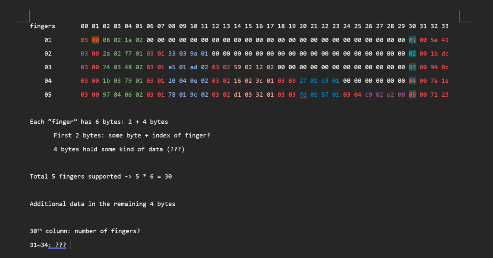

# touchpad-adventure

Repurposing [Framework](https://frame.work/)'s [Touchpad module for Framework 13'](https://frame.work/products/touchpad-kit?v=FRANFT0001) as a stand alone device using Raspberry Pi Pico, inspired by [Framework Magic Trackpad](https://community.frame.work/t/framework-magic-trackpad/19453) forum post and [HID articles on Hackaday by Arya Voronova](https://hackaday.com/2024/04/17/human-interfacing-devices-hid-over-i2c/)


## Framework touchpad module
Framework touchpad module is a 115 x 76.6mm glass panel that uses [PixArt PCT3854QR](https://www.pixart.com/products-detail/112/PCT3854QR) controller. Unfortunately PixArt does not provide documentation for this chipset, but it supports HID over I2C which simplifies matters a lot. 

In Framework laptop 13' model, both fingerprint reader and keyboard are connected to the touchpad module. Touchpad module then routes all three fingerprint reader / keyboard / touchpad signals to the motherboard via 51 pin ZIF connector-to-10156001-051100LF connector. Framework provides connector and pinout information on their [GitHub repository](https://github.com/FrameworkComputer/Framework-Laptop-13/tree/main/Touchpad). 

Since this touchpad uses HID over I2C protocol, I'm only interested in 5 out of the 51 pins: TP_SCL (Serial Clock Line), TP_SDA (Serial Data Line), TP_INT (Interrupt, Work in progress to get the INT working), GND, and 5VS.


| Pin | Conn | Signal | Notes|
|-----|----- | ------ | ----- |
| 33 | 17 | GND |  |
| 34  | 34   | TP_SCL | Touchpad I2C SCL -- Clock Line|
| 35 | 18 | TP_INT | Touchpad interrupt GPIO | 
| 36 | 33 | TP_SDA | Touchpad I2C SDA -- Data Line | 
| 38 | 32 | 5VS | 5V, Connected to 5VS rail through a 0 ohm resistor |
| 39 | 20 | 5VALW | Fingerprint 5V | 
| 40 | 31 | USB_N | Fingerprint USB | 
| 41 | 21 | GND |  |
| 42 | 20 | USB_P | Fingerprint USB | 
| 37 | 19 | TP_BOARD_ID | |
| 26 | 38 | GND |  |
| 29 | 15 | GND |  |
| 31 | 16 | GND |  |
| 49 | 25 | GND |  | 
| 48 | 27 | FPR_LED_COM | 5V, Fingerprint LED |

Above table shows the pin mapping between the ZIF connector (Pin column) and the 10156001-051100LF connector (Conn column). But since we're not using the 10156001-051100LF connector, this table is not relevant to us. 

Although the pinout says the touchpad module takes 5V input, I found that it works just fine with 3.3V which is found in a lot of microcontrollers. I'll be using Raspberry Pi Pico W for the remainder of this write up. 

## Assembly and probing

I ordered [51 pin ZIF breakout board](https://www.aliexpress.us/item/2251832656865723.html) from AliExpress and soldered headers on it. It looks like I can use any of the numerous GND pins, but I stuck to the one that's closest to my I2C pins. 

| Pin | Breakout board |
| --- |  --- |
| SDA |  36 |
| SCL |  34 | 
| GND |  33 |
| 5V |  40 |
| INT | 35 |

Initially I started out with an [Elite-C](https://deskthority.net/wiki/Elite-C) (Pro-Micro compatible board) running Arduino, because I thought I needed 5V to power the device. After connecting the microcontroller to the touchpad, I used the [I2C scanner sketch](https://playground.arduino.cc/Main/I2cScanner/) to see the available I2C addresses. Framework Touchpad module utilizes two I2C addresses, 0x2C and 0x33:

```
I2C device found at address 0x2C  ! (44)
I2C device found at address 0x33  ! (51)
done
```

Plugging the device to the Raspberry Pi 3B+ and running `i2cdetect` also revealed the same results: 
```
passionfruit@raspberrypi:~ $ i2cdetect -y 1
     0  1  2  3  4  5  6  7  8  9  a  b  c  d  e  f
00:                         -- -- -- -- -- -- -- --
10: -- -- -- -- -- -- -- -- -- -- -- -- -- -- -- --
20: -- -- -- -- -- -- -- -- -- -- -- -- 2c -- -- --
30: -- -- -- 33 -- -- -- -- -- -- -- -- -- -- -- --
40: -- -- -- -- -- -- -- -- -- -- -- -- -- -- -- --
50: -- -- -- -- -- -- -- -- -- -- -- -- -- -- -- --
60: -- -- -- -- -- -- -- -- -- -- -- -- -- -- -- --
70: -- -- -- -- -- -- -- --
```

Additional `i2cdump` results showed that there's something on 0x20 within this address at 0x2C: 

```
passionfruit@raspberrypi:~ $ i2cdump -y 1 0x2c
No size specified (using byte-data access)
     0  1  2  3  4  5  6  7  8  9  a  b  c  d  e  f    0123456789abcdef
00: 00 00 00 00 00 00 00 00 00 00 00 00 00 00 00 00    ................
10: 00 00 00 00 00 00 00 00 00 00 00 00 00 00 00 00    ................
20: 1e 06 00 00 00 00 00 00 00 00 00 00 00 00 00 00    ??..............
30: 00 00 00 00 00 00 00 00 00 00 00 00 00 00 00 00    ................
40: 00 00 00 00 00 00 00 00 00 00 00 00 00 00 00 00    ................
50: 00 00 00 00 00 00 00 00 00 00 00 00 00 00 00 00    ................
60: 00 00 00 00 00 00 00 00 00 00 00 00 00 00 00 00    ................
70: 00 00 00 00 00 00 00 00 00 00 00 00 00 00 00 00    ................
80: 00 00 00 00 00 00 00 00 00 00 00 00 00 00 00 00    ................
90: 00 00 00 00 00 00 00 00 00 00 00 00 00 00 00 00    ................
a0: 00 00 00 00 00 00 00 00 00 00 00 00 00 00 00 00    ................
b0: 00 00 00 00 00 00 00 00 00 00 00 00 00 00 00 00    ................
c0: 00 00 00 00 00 00 00 00 00 00 00 00 00 00 00 00    ................
d0: 00 00 00 00 00 00 00 00 00 00 00 00 00 00 00 00    ................
e0: 00 00 00 00 00 00 00 00 00 00 00 00 00 00 00 00    ................
f0: 00 00 00 00 00 00 00 00 00 00 00 00 00 00 00 00    ................
```

Then by pure luck, I learned that the device works just fine with 3.3V so I switched over to Raspberry Pi Pico W so that I can use micropython instead of Arduino code. This turned out to be a good decision because Arduino's Wire library by default reads less number of bytes than the HID input report sent from the touchpad module. And I was constantly hitting memory limit on Elite-C, though that's probably because my code was horribly inefficient.  

With some trial and error, I wrote some code based on the Python code provided in [Arya's Hackaday article](https://hackaday.com/2024/04/17/human-interfacing-devices-hid-over-i2c/) to read some data out of 0x2c - 0x20 on the touchpad device.

```python
# Scan for connected I2C devices  
import machine


SDA_PIN = machine.Pin(4)
SCL_PIN = machine.Pin(5)
i2c = machine.I2C(0, sda=SDA_PIN, scl=SCL_PIN, freq=500000)


TOUCHPAD_ADDR = 0x2c
REPORT_ID = 0x01 

def helper_function(abc):
    return ([abc[i:i+2] for i in range(0, len(abc), 2)])

def helper_function_to_int(myList):
    k = [int(x, 16) for x in myList]
    v = ["{:03d}".format(x) for x in k]
    return  [str(x) for x in v]

def runner():
    while True:
        try:
            l = i2c.readfrom(TOUCHPAD_ADDR, 1)[0]
            if l:
                d = i2c.readfrom(TOUCHPAD_ADDR, l)
                if d[2] != REPORT_ID:
                    print("WARNING")
                    print(l, d)
                else:
                    d = d[3:]
                    formatted = helper_function(d.hex())
                    output = helper_function_to_int(formatted)
                    print(" ".join(output))
                    
        except OSError:
            print("Nothing burger")
            

runner()
```

Using this code, I was able to consistently read 30 something bytes long data that changed every time I moved the finger around. It also changed depending on the number of fingers contacting the touchpad surface. This byte array was the actual HID input report sent from the device, but I did not understand what it meant at the time. 

## Finding HID report descriptor and understanding the report 



I made some best effort guesses to figure out what this data meant. But to really understand what is going on, I had to look at the HID report descriptor used by this touchpad device. 

HID Report is nothing more than a binary data sent from the HID device. HID Report descriptor is a schematic for a given HID report, which outlines what each parts of the report's binary data means and describes the range limit of each part. 

I had some data to work with, such as report descriptor data in [Arya's repository](https://github.com/0xAryaCAFE/spicy-micropython/blob/3810a95b423668ce8a7be2f6eb615eec5d33fedd/ports/rp2/tusb_port.c#L142). Apparently Arya and many other people were already here, but I couldn't readily find a way to turn this module into a stand alone device online.

I also learned that HID device usually stores its HID descriptor on the device so that the host machine can interact with it. I updated my earlier code to "dump" some data from each address under 0x2C. 

```python
def helper_function_to_int(myList):
    k = [int(x, 16) for x in myList]
    v = ["{:03d}".format(x) for x in k]
    return  [str(x) for x in v]

def brute_force():
    for i in range(0, 256):
        l = i2c.readfrom_mem(TOUCHPAD_ADDR, i, 64)
        print(i, " ".join(helper_function(l.hex())))
```

```bash
...
30 00 00 00 01 af 02 21 00 24 00 25 00 25 00 00 00 22 00 23 00 3a 09 74 02 04 07 00 00 00 00 00 00 00 03 00 91 f5 00 00 00 00 00 00 00 00 00 00 00 00 00 00 00 00 00 00 00 00 00 00 00 00 00 00 00
31 00 00 00 01 af 02 21 00 24 00 25 00 25 00 00 00 22 00 23 00 3a 09 74 02 04 07 00 00 00 00 00 00 00 03 00 91 f5 00 00 00 00 00 00 00 00 00 00 00 00 00 00 00 00 00 00 00 00 00 00 00 00 00 00 00

// ↓↓↓↓↓↓↓↓↓↓↓↓↓↓↓↓↓↓↓↓↓↓↓↓↓↓↓↓↓↓↓
32 1e 00 00 01 af 02 21 00 24 00 25 00 25 00 00 00 22 00 23 00 3a 09 74 02 04 07 00 00 00 00 00 00 00 00 00 00 00 00 00 00 00 00 00 00 00 00 00 00 00 00 00 00 00 00 00 00 00 00 00 00 00 00 00 00

// ↓↓↓↓↓↓↓↓↓↓↓↓↓↓↓↓↓↓↓↓↓↓↓↓↓↓↓↓↓↓↓
33 05 01 09 02 a1 01 85 02 05 01 09 01 a1 00 05 09 19 01 29 02 15 00 25 01 75 01 95 02 81 02 05 0d 09 32 75 01 95 01 81 02 75 05 95 01 81 03 05 01 75 10 95 01 35 00 45 00 16 00 80 26 ff 7f 09 30

34 00 00 00 01 af 02 21 00 24 00 25 00 25 00 00 00 22 00 23 00 3a 09 74 02 04 07 00 00 00 00 00 00 00 03 00 91 f5 00 00 00 00 00 00 00 00 00 00 00 00 00 00 00 00 00 00 00 00 00 00 00 00 00 00 00
35 00 00 00 01 af 02 21 00 24 00 25 00 25 00 00 00 22 00 23 00 3a 09 74 02 04 07 00 00 00 00 00 00 00 03 00 91 f5 00 00 00 00 00 00 00 00 00 00 00 00 00 00 00 00 00 00 00 00 00 00 00 00 00 00 00
...
```

And of course, the report descriptor was stored under 0x33. Using [Frank Zhao's USB Descriptor and Request Parser tool](https://eleccelerator.com/usbdescreqparser/), here's the HID report descriptor for the Framework's touchpad module.


```
0x05, 0x01,        // Usage Page (Generic Desktop Ctrls)
0x09, 0x02,        // Usage (Mouse)
0xA1, 0x01,        // Collection (Application)
0x85, 0x02,        //   Report ID (2)
0x05, 0x01,        //   Usage Page (Generic Desktop Ctrls)
0x09, 0x01,        //   Usage (Pointer)
0xA1, 0x00,        //   Collection (Physical)
0x05, 0x09,        //     Usage Page (Button)
0x19, 0x01,        //     Usage Minimum (0x01)
0x29, 0x02,        //     Usage Maximum (0x02)
0x15, 0x00,        //     Logical Minimum (0)
0x25, 0x01,        //     Logical Maximum (1)
0x75, 0x01,        //     Report Size (1)
0x95, 0x02,        //     Report Count (2)
0x81, 0x02,        //     Input (Data,Var,Abs,No Wrap,Linear,Preferred State,No Null Position)
0x05, 0x0D,        //     Usage Page (Digitizer)
0x09, 0x32,        //     Usage (In Range)
0x75, 0x01,        //     Report Size (1)
0x95, 0x01,        //     Report Count (1)
0x81, 0x02,        //     Input (Data,Var,Abs,No Wrap,Linear,Preferred State,No Null Position)
0x75, 0x05,        //     Report Size (5)
0x95, 0x01,        //     Report Count (1)
0x81, 0x03,        //     Input (Const,Var,Abs,No Wrap,Linear,Preferred State,No Null Position)
0x05, 0x01,        //     Usage Page (Generic Desktop Ctrls)
0x75, 0x10,        //     Report Size (16)
0x95, 0x01,        //     Report Count (1)
0x35, 0x00,        //     Physical Minimum (0)
0x45, 0x00,        //     Physical Maximum (0)
0x16, 0x00, 0x80,  //     Logical Minimum (-32768)
0x26, 0xFF, 0x7F,  //     Logical Maximum (32767)
0x09, 0x30,        //     Usage (X)
0x81, 0x26,        //     Input (Data,Var,Rel,No Wrap,Linear,No Preferred State,No Null Position)
0x16, 0x00, 0x80,  //     Logical Minimum (-32768)
0x26, 0xFF, 0x7F,  //     Logical Maximum (32767)
0x09, 0x31,        //     Usage (Y)
0x81, 0x26,        //     Input (Data,Var,Rel,No Wrap,Linear,No Preferred State,No Null Position)
0xC0,              //   End Collection
0xC0,              // End Collection
0x05, 0x0D,        // Usage Page (Digitizer)
0x09, 0x05,        // Usage (Touch Pad)
0xA1, 0x01,        // Collection (Application)
0x85, 0x01,        //   Report ID (1)
0x05, 0x0D,        //   Usage Page (Digitizer)
0x09, 0x22,        //   Usage (Finger)
0xA1, 0x02,        //   Collection (Logical)
0x09, 0x47,        //     Usage (0x47)
0x09, 0x42,        //     Usage (Tip Switch)
0x15, 0x00,        //     Logical Minimum (0)
0x25, 0x01,        //     Logical Maximum (1)
0x75, 0x01,        //     Report Size (1)
0x95, 0x02,        //     Report Count (2)
0x81, 0x02,        //     Input (Data,Var,Abs,No Wrap,Linear,Preferred State,No Null Position)
0x95, 0x06,        //     Report Count (6)
0x81, 0x03,        //     Input (Const,Var,Abs,No Wrap,Linear,Preferred State,No Null Position)
0x09, 0x51,        //     Usage (0x51)
0x25, 0x0F,        //     Logical Maximum (15)
0x75, 0x08,        //     Report Size (8)
0x95, 0x01,        //     Report Count (1)
0x81, 0x02,        //     Input (Data,Var,Abs,No Wrap,Linear,Preferred State,No Null Position)
0x05, 0x01,        //     Usage Page (Generic Desktop Ctrls)
0x09, 0x30,        //     Usage (X)
0x75, 0x10,        //     Report Size (16)
0x55, 0x0E,        //     Unit Exponent (-2)
0x65, 0x11,        //     Unit (System: SI Linear, Length: Centimeter)
0x35, 0x00,        //     Physical Minimum (0)
0x46, 0x5A, 0x04,  //     Physical Maximum (1114)
0x27, 0x39, 0x05, 0x00, 0x00,  //     Logical Maximum (1336)
0x81, 0x02,        //     Input (Data,Var,Abs,No Wrap,Linear,Preferred State,No Null Position)
0x09, 0x31,        //     Usage (Y)
0x46, 0xDA, 0x02,  //     Physical Maximum (730)
0x27, 0x6C, 0x03, 0x00, 0x00,  //     Logical Maximum (875)
0x81, 0x02,        //     Input (Data,Var,Abs,No Wrap,Linear,Preferred State,No Null Position)
0xC0,              //   End Collection
0x05, 0x0D,        //   Usage Page (Digitizer)
0x09, 0x22,        //   Usage (Finger)
0xA1, 0x02,        //   Collection (Logical)
0x09, 0x47,        //     Usage (0x47)
0x09, 0x42,        //     Usage (Tip Switch)
0x15, 0x00,        //     Logical Minimum (0)
0x25, 0x01,        //     Logical Maximum (1)
0x75, 0x01,        //     Report Size (1)
0x95, 0x02,        //     Report Count (2)
0x81, 0x02,        //     Input (Data,Var,Abs,No Wrap,Linear,Preferred State,No Null Position)
0x95, 0x06,        //     Report Count (6)
0x81, 0x03,        //     Input (Const,Var,Abs,No Wrap,Linear,Preferred State,No Null Position)
0x09, 0x51,        //     Usage (0x51)
0x25, 0x0F,        //     Logical Maximum (15)
0x75, 0x08,        //     Report Size (8)
0x95, 0x01,        //     Report Count (1)
0x81, 0x02,        //     Input (Data,Var,Abs,No Wrap,Linear,Preferred State,No Null Position)
0x05, 0x01,        //     Usage Page (Generic Desktop Ctrls)
0x09, 0x30,        //     Usage (X)
0x75, 0x10,        //     Report Size (16)
0x55, 0x0E,        //     Unit Exponent (-2)
0x65, 0x11,        //     Unit (System: SI Linear, Length: Centimeter)
0x35, 0x00,        //     Physical Minimum (0)
0x46, 0x5A, 0x04,  //     Physical Maximum (1114)
0x27, 0x39, 0x05, 0x00, 0x00,  //     Logical Maximum (1336)
0x81, 0x02,        //     Input (Data,Var,Abs,No Wrap,Linear,Preferred State,No Null Position)
0x09, 0x31,        //     Usage (Y)
0x46, 0xDA, 0x02,  //     Physical Maximum (730)
0x27, 0x6C, 0x03, 0x00, 0x00,  //     Logical Maximum (875)
0x81, 0x02,        //     Input (Data,Var,Abs,No Wrap,Linear,Preferred State,No Null Position)
0xC0,              //   End Collection
0x05, 0x0D,        //   Usage Page (Digitizer)
0x09, 0x22,        //   Usage (Finger)
0xA1, 0x02,        //   Collection (Logical)
0x09, 0x47,        //     Usage (0x47)
0x09, 0x42,        //     Usage (Tip Switch)
0x15, 0x00,        //     Logical Minimum (0)
0x25, 0x01,        //     Logical Maximum (1)
0x75, 0x01,        //     Report Size (1)
0x95, 0x02,        //     Report Count (2)
0x81, 0x02,        //     Input (Data,Var,Abs,No Wrap,Linear,Preferred State,No Null Position)
0x95, 0x06,        //     Report Count (6)
0x81, 0x03,        //     Input (Const,Var,Abs,No Wrap,Linear,Preferred State,No Null Position)
0x09, 0x51,        //     Usage (0x51)
0x25, 0x0F,        //     Logical Maximum (15)
0x75, 0x08,        //     Report Size (8)
0x95, 0x01,        //     Report Count (1)
0x81, 0x02,        //     Input (Data,Var,Abs,No Wrap,Linear,Preferred State,No Null Position)
0x05, 0x01,        //     Usage Page (Generic Desktop Ctrls)
0x09, 0x30,        //     Usage (X)
0x75, 0x10,        //     Report Size (16)
0x55, 0x0E,        //     Unit Exponent (-2)
0x65, 0x11,        //     Unit (System: SI Linear, Length: Centimeter)
0x35, 0x00,        //     Physical Minimum (0)
0x46, 0x5A, 0x04,  //     Physical Maximum (1114)
0x27, 0x39, 0x05, 0x00, 0x00,  //     Logical Maximum (1336)
0x81, 0x02,        //     Input (Data,Var,Abs,No Wrap,Linear,Preferred State,No Null Position)
0x09, 0x31,        //     Usage (Y)
0x46, 0xDA, 0x02,  //     Physical Maximum (730)
0x27, 0x6C, 0x03, 0x00, 0x00,  //     Logical Maximum (875)
0x81, 0x02,        //     Input (Data,Var,Abs,No Wrap,Linear,Preferred State,No Null Position)
0xC0,              //   End Collection
0x05, 0x0D,        //   Usage Page (Digitizer)
0x09, 0x22,        //   Usage (Finger)
0xA1, 0x02,        //   Collection (Logical)
0x09, 0x47,        //     Usage (0x47)
0x09, 0x42,        //     Usage (Tip Switch)
0x15, 0x00,        //     Logical Minimum (0)
0x25, 0x01,        //     Logical Maximum (1)
0x75, 0x01,        //     Report Size (1)
0x95, 0x02,        //     Report Count (2)
0x81, 0x02,        //     Input (Data,Var,Abs,No Wrap,Linear,Preferred State,No Null Position)
0x95, 0x06,        //     Report Count (6)
0x81, 0x03,        //     Input (Const,Var,Abs,No Wrap,Linear,Preferred State,No Null Position)
0x09, 0x51,        //     Usage (0x51)
0x25, 0x0F,        //     Logical Maximum (15)
0x75, 0x08,        //     Report Size (8)
0x95, 0x01,        //     Report Count (1)
0x81, 0x02,        //     Input (Data,Var,Abs,No Wrap,Linear,Preferred State,No Null Position)
0x05, 0x01,        //     Usage Page (Generic Desktop Ctrls)
0x09, 0x30,        //     Usage (X)
0x75, 0x10,        //     Report Size (16)
0x55, 0x0E,        //     Unit Exponent (-2)
0x65, 0x11,        //     Unit (System: SI Linear, Length: Centimeter)
0x35, 0x00,        //     Physical Minimum (0)
0x46, 0x5A, 0x04,  //     Physical Maximum (1114)
0x27, 0x39, 0x05, 0x00, 0x00,  //     Logical Maximum (1336)
0x81, 0x02,        //     Input (Data,Var,Abs,No Wrap,Linear,Preferred State,No Null Position)
0x09, 0x31,        //     Usage (Y)
0x46, 0xDA, 0x02,  //     Physical Maximum (730)
0x27, 0x6C, 0x03, 0x00, 0x00,  //     Logical Maximum (875)
0x81, 0x02,        //     Input (Data,Var,Abs,No Wrap,Linear,Preferred State,No Null Position)
0xC0,              //   End Collection
0x05, 0x0D,        //   Usage Page (Digitizer)
0x09, 0x22,        //   Usage (Finger)
0xA1, 0x02,        //   Collection (Logical)
0x09, 0x47,        //     Usage (0x47)
0x09, 0x42,        //     Usage (Tip Switch)
0x15, 0x00,        //     Logical Minimum (0)
0x25, 0x01,        //     Logical Maximum (1)
0x75, 0x01,        //     Report Size (1)
0x95, 0x02,        //     Report Count (2)
0x81, 0x02,        //     Input (Data,Var,Abs,No Wrap,Linear,Preferred State,No Null Position)
0x95, 0x06,        //     Report Count (6)
0x81, 0x03,        //     Input (Const,Var,Abs,No Wrap,Linear,Preferred State,No Null Position)
0x09, 0x51,        //     Usage (0x51)
0x25, 0x0F,        //     Logical Maximum (15)
0x75, 0x08,        //     Report Size (8)
0x95, 0x01,        //     Report Count (1)
0x81, 0x02,        //     Input (Data,Var,Abs,No Wrap,Linear,Preferred State,No Null Position)
0x05, 0x01,        //     Usage Page (Generic Desktop Ctrls)
0x09, 0x30,        //     Usage (X)
0x75, 0x10,        //     Report Size (16)
0x55, 0x0E,        //     Unit Exponent (-2)
0x65, 0x11,        //     Unit (System: SI Linear, Length: Centimeter)
0x35, 0x00,        //     Physical Minimum (0)
0x46, 0x5A, 0x04,  //     Physical Maximum (1114)
0x27, 0x39, 0x05, 0x00, 0x00,  //     Logical Maximum (1336)
0x81, 0x02,        //     Input (Data,Var,Abs,No Wrap,Linear,Preferred State,No Null Position)
0x09, 0x31,        //     Usage (Y)
0x46, 0xDA, 0x02,  //     Physical Maximum (730)
0x27, 0x6C, 0x03, 0x00, 0x00,  //     Logical Maximum (875)
0x81, 0x02,        //     Input (Data,Var,Abs,No Wrap,Linear,Preferred State,No Null Position)
0xC0,              //   End Collection
0x05, 0x0D,        //   Usage Page (Digitizer)
0x09, 0x54,        //   Usage (0x54)
0x15, 0x00,        //   Logical Minimum (0)
0x25, 0x05,        //   Logical Maximum (5)
0x75, 0x08,        //   Report Size (8)
0x95, 0x01,        //   Report Count (1)
0x81, 0x02,        //   Input (Data,Var,Abs,No Wrap,Linear,Preferred State,No Null Position)
0x05, 0x09,        //   Usage Page (Button)
0x09, 0x01,        //   Usage (0x01)
0x09, 0x02,        //   Usage (0x02)
0x09, 0x03,        //   Usage (0x03)
0x15, 0x00,        //   Logical Minimum (0)
0x25, 0x01,        //   Logical Maximum (1)
0x75, 0x01,        //   Report Size (1)
0x95, 0x03,        //   Report Count (3)
0x81, 0x02,        //   Input (Data,Var,Abs,No Wrap,Linear,Preferred State,No Null Position)
0x95, 0x05,        //   Report Count (5)
0x81, 0x03,        //   Input (Const,Var,Abs,No Wrap,Linear,Preferred State,No Null Position)
0x05, 0x0D,        //   Usage Page (Digitizer)
0x09, 0x56,        //   Usage (0x56)
0x55, 0x0C,        //   Unit Exponent (-4)
0x66, 0x01, 0x10,  //   Unit (System: SI Linear, Time: Seconds)
0x35, 0x00,        //   Physical Minimum (0)
0x47, 0xFF, 0xFF, 0x00, 0x00,  //   Physical Maximum (65534)
0x15, 0x00,        //   Logical Minimum (0)
0x27, 0xFF, 0xFF, 0x00, 0x00,  //   Logical Maximum (65534)
0x75, 0x10,        //   Report Size (16)
0x95, 0x01,        //   Report Count (1)
0x81, 0x02,        //   Input (Data,Var,Abs,No Wrap,Linear,Preferred State,No Null Position)
0x05, 0x0D,        //   Usage Page (Digitizer)
0x09, 0x55,        //   Usage (0x55)
0x15, 0x00,        //   Logical Minimum (0)
0x25, 0x05,        //   Logical Maximum (5)
0x75, 0x08,        //   Report Size (8)
0x95, 0x01,        //   Report Count (1)
0x85, 0x03,        //   Report ID (3)
0xB1, 0x02,        //   Feature (Data,Var,Abs,No Wrap,Linear,Preferred State,No Null Position,Non-volatile)
0x05, 0x0D,        //   Usage Page (Digitizer)
0x09, 0x59,        //   Usage (0x59)
0x15, 0x00,        //   Logical Minimum (0)
0x25, 0x0F,        //   Logical Maximum (15)
0x75, 0x08,        //   Report Size (8)
0x95, 0x01,        //   Report Count (1)
0x85, 0x04,        //   Report ID (4)
0xB1, 0x02,        //   Feature (Data,Var,Abs,No Wrap,Linear,Preferred State,No Null Position,Non-volatile)
0x06, 0x00, 0xFF,  //   Usage Page (Vendor Defined 0xFF00)
0x85, 0x05,        //   Report ID (5)
0x75, 0x08,        //   Report Size (8)
0x15, 0x00,        //   Logical Minimum (0)
0x09, 0xC6,        //   Usage (0xC6)
0x25, 0x08,        //   Logical Maximum (8)
0x95, 0x01,        //   Report Count (1)
0xB1, 0x02,        //   Feature (Data,Var,Abs,No Wrap,Linear,Preferred State,No Null Position,Non-volatile)
0x09, 0xC7,        //   Usage (0xC7)
0x26, 0xFF, 0x00,  //   Logical Maximum (255)
0x95, 0x20,        //   Report Count (32)
0xB1, 0x02,        //   Feature (Data,Var,Abs,No Wrap,Linear,Preferred State,No Null Position,Non-volatile)
0xC0,              // End Collection
0x05, 0x0D,        // Usage Page (Digitizer)
0x09, 0x0E,        // Usage (0x0E)
0xA1, 0x01,        // Collection (Application)
0x05, 0x0D,        //   Usage Page (Digitizer)
0x09, 0x22,        //   Usage (Finger)
0xA1, 0x02,        //   Collection (Logical)
0x09, 0x52,        //     Usage (0x52)
0x15, 0x00,        //     Logical Minimum (0)
0x25, 0x0A,        //     Logical Maximum (10)
0x75, 0x08,        //     Report Size (8)
0x95, 0x01,        //     Report Count (1)
0x85, 0x06,        //     Report ID (6)
0xB1, 0x02,        //     Feature (Data,Var,Abs,No Wrap,Linear,Preferred State,No Null Position,Non-volatile)
0xC0,              //   End Collection
0x05, 0x0D,        //   Usage Page (Digitizer)
0x09, 0x22,        //   Usage (Finger)
0xA1, 0x00,        //   Collection (Physical)
0x09, 0x57,        //     Usage (0x57)
0x09, 0x58,        //     Usage (0x58)
0x15, 0x00,        //     Logical Minimum (0)
0x25, 0x01,        //     Logical Maximum (1)
0x75, 0x01,        //     Report Size (1)
0x95, 0x02,        //     Report Count (2)
0x85, 0x07,        //     Report ID (7)
0xB1, 0x02,        //     Feature (Data,Var,Abs,No Wrap,Linear,Preferred State,No Null Position,Non-volatile)
0x95, 0x06,        //     Report Count (6)
0xB1, 0x03,        //     Feature (Const,Var,Abs,No Wrap,Linear,Preferred State,No Null Position,Non-volatile)
0xC0,              //   End Collection
0x05, 0x0D,        //   Usage Page (Digitizer)
0x09, 0x60,        //   Usage (0x60)
0x15, 0x00,        //   Logical Minimum (0)
0x25, 0x01,        //   Logical Maximum (1)
0x75, 0x01,        //   Report Size (1)
0x95, 0x01,        //   Report Count (1)
0x85, 0x08,        //   Report ID (8)
0xB1, 0x02,        //   Feature (Data,Var,Abs,No Wrap,Linear,Preferred State,No Null Position,Non-volatile)
0x95, 0x07,        //   Report Count (7)
0xB1, 0x03,        //   Feature (Const,Var,Abs,No Wrap,Linear,Preferred State,No Null Position,Non-volatile)
0xC0,              // End Collection
0x06, 0x00, 0xFF,  // Usage Page (Vendor Defined 0xFF00)
0x09, 0x01,        // Usage (0x01)
0xA1, 0x01,        // Collection (Application)
0x85, 0x42,        //   Report ID (66)
0x09, 0x06,        //   Usage (0x06)
0x15, 0x00,        //   Logical Minimum (0)
0x26, 0xFF, 0x00,  //   Logical Maximum (255)
0x75, 0x08,        //   Report Size (8)
0x95, 0x03,        //   Report Count (3)
0xB1, 0x02,        //   Feature (Data,Var,Abs,No Wrap,Linear,Preferred State,No Null Position,Non-volatile)
0x06, 0x00, 0xFF,  //   Usage Page (Vendor Defined 0xFF00)
0x09, 0x05,        //   Usage (0x05)
0x15, 0x00,        //   Logical Minimum (0)
0x26, 0xFF, 0x00,  //   Logical Maximum (255)
0x75, 0x08,        //   Report Size (8)
0x96, 0x00, 0x01,  //   Report Count (256)
0x85, 0x41,        //   Report ID (65)
0xB1, 0x02,        //   Feature (Data,Var,Abs,No Wrap,Linear,Preferred State,No Null Position,Non-volatile)
0x85, 0x43,        //   Report ID (67)
0x09, 0x06,        //   Usage (0x06)
0x15, 0x00,        //   Logical Minimum (0)
0x26, 0xFF, 0x00,  //   Logical Maximum (255)
0x75, 0x08,        //   Report Size (8)
0x95, 0x03,        //   Report Count (3)
0xB1, 0x02,        //   Feature (Data,Var,Abs,No Wrap,Linear,Preferred State,No Null Position,Non-volatile)
0xC0,              // End Collection

// 687 bytes

```

In addition to the report descriptor, I found that register 0x20 holds [Required I2C HID Descriptor](https://learn.microsoft.com/en-us/windows-hardware/design/component-guidelines/touchpad-required-hid-descriptors) information. 

| Member | Size in Bytes | Description | value in hex | value in dec or decoded |
| ---- | ---- | ---- | ---- | ---- |
| wHIDDescLength | 2 | The length of the complete HID descriptor (in Bytes) |  `1e 00` = `0x001e` | 30 |
| bcdVersion | 2 | The version number, in binary coded decimal format | `00 01` = `0x0100` | 4 |
| wReportDescLength | 2 | The length of the Report descriptor (in Bytes) | `af 02` = `0x02af` | 687 |
| wReportDescRegister | 2 | The register index containing the report descriptor | `21 00` = `0x21` | 33 |
| wInputRegister | 2 | The register number to read the input report | `24 00` = `0x24` | 36 | 
| wMaxInputLength | 2 | The length of the largest input report to be read from the input register | `25 00` = `0x25` | 37 |
| wOutputRegister | 2 | The register number to send the output | `25 00` = `0x25` | 37 |
| wMaxOutputLength | 2 | The length of the largest output report to be sent | `00 00` = `0x00` | 0 |
| wCommandRegister | 2 | The register number to send command requests | `22 00` = `0x22` | 34 |
| wDataRegister | 2 | The register number to exchange data with command requests | `23 00` = `0x23` | 35 | 
| wVendorID | 2 | USB-IF assigned Vendor ID | `3a 09` = `0x093a` | 2362 |
| wDeviceID | 2 | Device ID | `74 02` = `0x0274` | 628 | 
| wVersionID | 2 | Firmware version number | `04 07` = `0x0704` | 1796 |

All in all, these addresses hold the key information: 

Address: 0x2C
- 0x20: Required I2C HID Descriptor
- 0x21: HID Input Report Descriptor
- 0x24: HID Input Report 


And using the HID report descriptor, I now know what each parts of my report means. 

Each finger gets 6 bytes: 

| Finger <N> Confidence + Tip Switch | Finger <N> index | Finger <N> X Lower Byte | Finger <N> X Higher Byte | Finger <N> Y  Lower Byte | Finger <N> Y Higher Byte | 
|---|---|---|---|---|---|
|03 | 00 | f3 | 04 | 37 | 00 |


And the remaining bytes in the report shows contact count (number of fingers detected) and scan time.

The complete descriptor table looks like this: 

| | index | example |
|---|---|---|
| Finger 0 Confidence + Tip Switch | 00 | 03 |
| Finger 0 index | 01 | 00 |
| Finger 0 X Lower Byte | 02 | f3 |
| Finger 0 X Higher Byte | 03 | 04 |
| Finger 0 Y Lower Byte | 04 | 37 |
| Finger 0 Y Higher Byte | 05 | 00 |
| Finger 1 Confidence + Tip Switch | 06 | 03 |
| Finger 1 index | 07 | 01 |
| Finger 1 X Lower Byte | 08 | f3 |
| Finger 1 X Higher Byte | 09 | 04 |
| Finger 1 Y Lower Byte | 10 | 37 |
| Finger 1 Y Higher Byte | 11 | 00 |
| Finger 2 Confidence + Tip Switch | 12 | 03 |
| Finger 2 index | 13 | 02 |
| Finger 2 X Lower Byte | 14 | f3 |
| Finger 2 X Higher Byte | 15 | 04 |
| Finger 2 Y Lower Byte | 16 | 37 |
| Finger 2 Y Higher Byte | 17 | 00 |
| Finger 3 Confidence + Tip Switch | 18 | 03 |
| Finger 3 index | 19 | 03 |
| Finger 3 X Lower Byte | 20 | f3 |
| Finger 3 X Higher Byte | 21 | 04 |
| Finger 3 Y Lower Byte | 22 | 37 |
| Finger 3 Y Higher Byte | 23 | 00 |
| Finger 4 Confidence + Tip Switch | 24 | 03 |
| Finger 4 index | 25 | 04 |
| Finger 4 X Lower Byte | 26 | f3 |
| Finger 4 X Higher Byte | 27 | 04 |
| Finger 4 Y Lower Byte | 28 | 37 |
| Finger 4 Y Higher Byte | 29 | 00 |
| Number of fingers (Contact Count) | 30 | 05 |
| Number of Buttons pressed | 31 | 00 |
| Scan time lower byte | 32 | e2 |
| Scan time higher byte | 33 | d5 |

## Putting everything together

Now that I have the descriptor and where to find the report, it's time to actually put everything together and send the report to the host system. I thought I had to read the HID report and then convert it into some kind of mouse movement within the microcontroller code, but it turns out I can simply forward the HID report and the host system can pick up whatever signal I'm sending to the touchpad. 

Starting in Micropython version 1.23, [Micropython supports USB device mode](https://github.com/micropython/micropython-lib/tree/master/micropython/usb) that allows using Raspberry Pi Pico as USB HID device. By combining my existing code and the sample [mouse.py](https://github.com/micropython/micropython-lib/blob/master/micropython/usb/usb-device-mouse/usb/device/mouse.py) within the library, I now have the following firmware code (also available in [firwmare directory](https://github.com/jeongm-in/touchpad-adventure/blob/main/firmware))

- prerequsite: needs `usb-device-hid` package

And by simply plugging my Raspberry Pi Pico into my Fedora 41, I can move the cursor around and use all of the gestures supported in this touchpad. 

## Verification 
In Fedora 41, I verified my Raspberry Pi Pico W shows up under `lsusb`: 

```bash
$ lsusb
Bus 005 Device 012: ID 2e8a:0005 MicroPython Board in FS mode
```

HID descriptor reported from the device looks fine: 

```bash
$ usbhid-dump -d2e8a:0005 -ed
005:012:002:DESCRIPTOR         1734844197.053573
 05 0D 09 05 A1 01 85 01 05 0D 09 22 A1 02 09 47
 09 42 15 00 25 01 75 01 95 02 81 02 95 06 81 03
 09 51 25 0F 75 08 95 01 81 02 05 01 09 30 75 10
 55 0E 65 11 35 00 46 5A 04 27 39 05 00 00 81 02
 09 31 46 DA 02 27 6C 03 00 00 81 02 C0 05 0D 09
 22 A1 02 09 47 09 42 15 00 25 01 75 01 95 02 81
 02 95 06 81 03 09 51 25 0F 75 08 95 01 81 02 05
 01 09 30 75 10 55 0E 65 11 35 00 46 5A 04 27 39
 05 00 00 81 02 09 31 46 DA 02 27 6C 03 00 00 81
 02 C0 05 0D 09 22 A1 02 09 47 09 42 15 00 25 01
 75 01 95 02 81 02 95 06 81 03 09 51 25 0F 75 08
 95 01 81 02 05 01 09 30 75 10 55 0E 65 11 35 00
 46 5A 04 27 39 05 00 00 81 02 09 31 46 DA 02 27
 6C 03 00 00 81 02 C0 05 0D 09 22 A1 02 09 47 09
 42 15 00 25 01 75 01 95 02 81 02 95 06 81 03 09
 51 25 0F 75 08 95 01 81 02 05 01 09 30 75 10 55
 0E 65 11 35 00 46 5A 04 27 39 05 00 00 81 02 09
 31 46 DA 02 27 6C 03 00 00 81 02 C0 05 0D 09 22
 A1 02 09 47 09 42 15 00 25 01 75 01 95 02 81 02
 95 06 81 03 09 51 25 0F 75 08 95 01 81 02 05 01
 09 30 75 10 55 0E 65 11 35 00 46 5A 04 27 39 05
 00 00 81 02 09 31 46 DA 02 27 6C 03 00 00 81 02
 C0 05 0D 09 54 15 00 25 05 75 08 95 01 81 02 05
 09 09 01 09 02 09 03 15 00 25 01 75 01 95 03 81
 02 95 05 81 03 05 0D 09 56 55 0C 66 01 10 35 00
 47 FF FF 00 00 15 00 27 FF FF 00 00 75 10 95 01
 81 02
```

And finally, the report looks good (and works): 

```bash
$ usbhid-dump -d2e8a:0005 -es
005:012:002:STREAM             1734843878.706360
 01 03 00 24 05 1E 00 00

005:012:002:STREAM             1734843878.714355
 00 00 00 00 00 00 00 00

005:012:002:STREAM             1734843878.722349
 00 00 00 00 00 00 00 00

005:012:002:STREAM             1734843878.730613
 00 00 00 00 00 00 00 01

005:012:002:STREAM             1734843878.738339
 00 BC 00
```

## Next steps 

- [ ] Touchpad currently does not work on Windows. Need to find out why it's not working and come up with a fix (driver issue?) 
- [x] Current firmware code relies on polling. Touchpad has Interrupt pin, so I assume interrupt based report is possible. 
  - done, but needs to optimize as interrupt is buggy. 
- Design a custom PCB with smaller footprint that integrates both RP2040 (complete RPI Pico board?) and the ZIF breakout for the 5 pins. 
- Design a 3D printed enclosure to mount the PCB and touchpad module. 

## Stretch goals 
- Wireless report transfer (ESP32?)
- Add Fingerprint sensor (could be a standalone project)